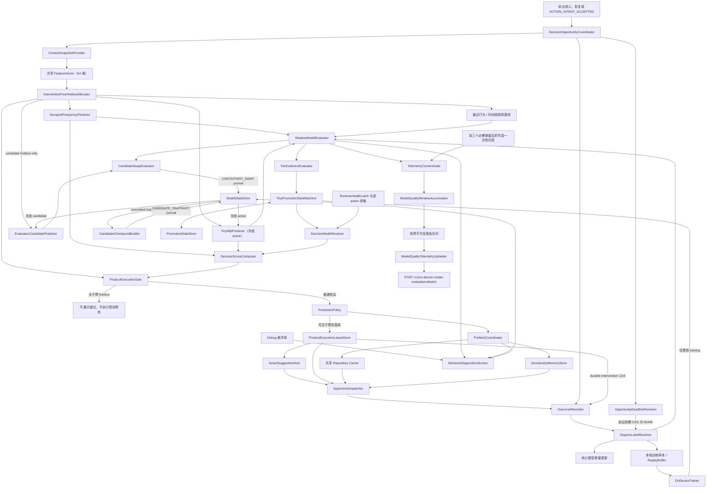

# AHUTong Android 端侧用户行为预测与智能预加载实施方案

> - 状态：最终实施设计
> - 目标分支：`p/Yukon163/feat/on-device-llm`
> - 代码基线：`a9a2e7b`（3.2.1）
> - 适用范围：Android 客户端、模型质量遥测服务端及配套隐私合规
> - 核心目标：在设备本地持续预测用户的下一项语义业务动作，并用安全预热和“猜你想用”缩短操作路径

## 1. 最终方案结论

本功能是“端侧连续下一行为预测”，不是大语言模型。最终版本采用统计模型与 Tiny MLP 双轨架构：

- `DecayedFrequencyPredictor` 与 `TinyMlpPredictor` 对每个合格预测机会接收同一个不可变上下文，并同时输出完整动作目录上的下一行为概率。
- 统计模型从第一条合格自然行为开始学习，始终作为冷启动模型、强基线和任何异常下的故障兜底。
- Tiny MLP 在设备本地执行前向计算、反向传播和增量训练。原始行为、逐次标签、特征、逐次概率、回放样本、模型权重和优化器状态不离开设备。
- Tiny MLP 按 `SHADOW → ELIGIBLE → MIXED → PRIMARY` 自动晋级，禁止跨级。每个账号都从 `SHADOW` 开始，满足本地多指标门槛后可自动到达 `PRIMARY`，不需要用户批准模型阶段，也不存在远端放行上限。
- `MIXED` 依次使用 `0.10 → 0.25 → 0.50` 的 Tiny 权重。进入 `PRIMARY` 后统计模型仍对相同上下文并行预测、学习和评估，并能在同一次决策内立即接管。
- 最终预测目标从一开始就是连续的：进入前台、恢复到稳定前台，以及每个合格语义动作的唯一 `ACTION_INTENT_ACCEPTED` 里程碑都可创建下一行为预测机会。模型晋级只改变概率合成方式，不改变触发时机、标签定义或动作目录。
- 当前 APK 中所有已注册的登录后语义业务动作都进入版本化完整目录；不是只支持课表、付款码、考场和充值。每个动作分别声明是否可训练、可建议、可预热及其副作用等级。
- 本地预测、统计学习、Tiny 训练和自动晋级在用户接受覆盖本地个性化处理的隐私协议并登录后默认运行。它们不提供单独的模型开关。
- 设置中的历史键 `personalization_enabled` 默认开启，但用户可见文案改为“猜你想用”。关闭后只隐藏并撤销建议气泡，不停止事件记录、预测、训练、自动晋级或智能预热。
- `predictive_prefetch_enabled` 默认开启；用户关闭后仅停止预测预热，不影响本地学习和建议概率计算。
- 付款码允许预测后向学校第一方服务提前请求实际二维码，以仅内存、短 TTL、账号绑定的安全信封保存；用户点击付款码入口或建议后可直接展示。预热不能自动发起交易，二维码不得落盘、记录或进入模型与遥测。
- “帮助改进模型质量”是首次启动流程中的一次独立、显著、主动选择：在现有三个必需弹窗依次通过后立即展示。用户可同意或“暂不开启”，两种选择都能进入 App；设置页不再重复提供该选项。用户同意后，统计模型与 Tiny MLP 的最小化聚合质量指标及两个开始学习日期的日级信息默认上传，没有灰度或第二道开关；跳过或撤回不影响任何端侧能力。
- `model_diagnostics_enabled` 只在 Debug 包存在且默认开启。Debug 主界面提供应用内悬浮球，点击进入可视化诊断页；Release 包不包含悬浮球、强制阶段、原始轨迹导出或调试路由。
- Tiny MLP 使用纯 Kotlin 实现小型网络的前向与反向传播，不依赖 LiteRT 在线训练能力，不引入 LLM、TFLite、ONNX Runtime 或 GRU。

整体架构如下：



## 2. 产品目标与边界

### 2.1 产品目标

1. 在用户使用 App 的整个前台周期内持续预测下一项语义业务动作，而不是只预测进入首页后的第一个动作。
2. 对完整动作目录中的安全资源做成本感知预热，使用户手动点击或点击建议后尽量直接展示。
3. 在任何适合展示的稳定页面提供“猜你想用”气泡，同时用全局频控、页面避让和反馈隔离避免打扰。
4. 用时间、动作序列、业务上下文和个人历史学习个体规律，例如固定时间看课表、考试临近查询考场、低余额后进入充值。
5. 通过严格的训练前配对评估、本地无干预 holdout 和自动降级，让 Tiny MLP 只有在持续优于强基线时才参与真实决策。
6. 模型故障、状态损坏、资源紧张或数据不足时，原有导航、页面、手动刷新、付款码和充值流程仍可用。
7. 在用户单独同意后上传最小化聚合质量数据，评估统计模型与 Tiny MLP 的真实效果，同时保持端侧学习与上传完全解耦。

### 2.2 明确不做

- 不读取其他 App 的界面、使用记录、通知或无障碍内容。
- 不截取屏幕、做 OCR，也不采集原始手势轨迹、点击坐标或连续触摸数据。
- 不记录原始搜索词、输入框内容、剪贴板、密码、Token、Cookie、二维码、订单号或支付 URL。
- 不采集精确位置、后台位置、加速度计或陀螺仪原始序列，也不推断“是否躺着”。若未来确有必要，必须另行做目的、授权、消融收益、耗电和合规评审。
- 不在 App 被杀死后常驻监听，也不因系统解锁在后台启动模型。
- 不让模型生成 route、反射调用方法或执行未注册函数。模型只能在当前 APK 的版本化动作目录中评分。
- 不自动填写充值金额、创建订单、确认缴费、发起支付、打开第三方支付或执行其他不可逆操作。
- 不上传任何逐次数据、端侧模型参数或优化器状态，不将这些数据旁路写入 Bugly、普通日志或业务接口。
- 不把去标识化表述为完全匿名。
- Transformer、跨用户训练和云端个性化模型不在本次最终交付。GRU 仅保留为需要另行立项的可选研究；若未来采用，必须重新定义 schema、评估和隐私边界，不能继承 Tiny MLP 的晋级证据。

## 3. 当前工程现状与实施影响

Android 工程为单 app 模块、单 Activity、Jetpack Compose 导航，已有 Hilt、协程、Retrofit、MMKV/Rust KV 和 Preferences DataStore，但尚无统一业务动作事件库、模型状态仓库、完整缓存 freshness 语义或预热调度器。

| 现状 | 代码位置 | 实施影响 |
|---|---|---|
| 登录后主动调用 `loadActivityBean`、`loadConfig`、`refreshSchedule` | `MainActivity.kt` | 先消除重复请求，再把启动加载纳入共享缓存与 single-flight |
| Home 再次调用 `loadActivityBean` | `ui/screen/main/Home.kt` | 需要合并重复加载，首页首帧不得等待模型 |
| Home 每 30 秒刷新余额 | `Home.kt` | 增加 freshness、前后台取消和同资源请求合并 |
| 课表已有按学期缓存 | `AHURepository.kt`、`AHUCache.kt`、`ScheduleViewModel.kt` | 可直接演进为带 TTL 的共享缓存 |
| 考场先展示缓存、进入页仍强制刷新 | `ExamViewModel.kt` | 预热和页面刷新必须共用一个 Repository 请求 |
| 付款码在 `QRcodeView` 组合后才请求 | `CampusCard.kt`、`DiscoveryViewModel.kt` | 下沉到账号绑定的共享 Repository 与敏感内存容器 |
| 二维码展开是页面内部 `remember` 状态 | `CampusCard.kt` | 提升为受控 action，建议点击与普通入口复用同一流程 |
| 充值页 ViewModel 加载账户信息并包含交易方法 | `CardBalanceDepositViewModel.kt` | 只读预热与交易命令必须类型和依赖隔离 |
| 路由与内部动作散落 | `Main.kt`、`BottomNavBar.kt`、`HomeWidgetRegistry.kt` | 建立类型化 `AppActionCatalog` 和统一 Dispatcher |
| 当前没有统一业务行为事件 | 全工程 | 必须先完成 source、去重、标签截止时间和反馈污染规则 |
| 当前没有 ML Runtime | Gradle 配置 | 纯 Kotlin 数学内核更符合小模型和在线训练需求 |
| 当前没有 WorkManager | Gradle 配置 | 仅为遥测上传与撤回删除引入；本地训练仍用前台短协程 |
| 隐私接受状态不是质量遥测授权 | `Splash.kt`、`PreferencesManager.kt` | 本地学习写入主隐私说明；聚合上传继续单独主动选择 |

实施前还应修正两个时序问题：

1. 所有预测初始化必须发生在隐私协议接受、登录 profile 明确且本地依赖可用之后；不能在 Splash 同意之前启动行为记录。
2. 隐私文案需要准确区分“仅本地处理的数据”和“另行同意后上传的聚合质量字段”，不能继续使用与实际能力冲突的绝对“不上传任何数据”表述。

## 4. 完整动作目录

### 4.1 目录原则

`AppActionCatalog` 是当前 APK 内所有登录后语义用户动作的唯一事实源。所谓“所有动作”指可解释、可去重的业务意图，不包括 Compose 重组、滚动像素、按键坐标、输入字符、自动刷新回调或系统生命周期噪声。

每个动作必须声明：

```kotlin
data class AppActionSpec(
    val id: AppActionId,
    val family: ActionFamily,
    val route: TypedRoute?,
    val labelEligible: Boolean,
    val predictable: Boolean,
    val predictionMilestone: PredictionMilestone?,
    val suggestible: Boolean,
    val prefetchPolicy: PrefetchPolicy,
    val sideEffect: SideEffect,
    val sensitivity: Sensitivity,
    val availability: suspend (ActionContext) -> Boolean
)
```

约束如下：

- action ID 永久稳定、禁止复用；route 参数不进入 action ID、模型特征或遥测。
- 所有 `predictable=true` 的动作都进入两个模型的输出目录，不以业务热度或开发便利裁剪。
- `suggestible`、`prefetchPolicy` 和 `sideEffect` 是模型之后的执行能力，不改变训练类别。
- 交易确认动作可以被观察和预测，但必须是 `suggestible=false`、`prefetchPolicy=NONE`，且永远不能由 Dispatcher 自动执行。
- 当前 catalog 中所有已知、合格的语义动作都有独立输出，不得落入 `OTHER`。`OTHER` 只作为 schema 保留类，承接旧输出 schema 明确定义的前向兼容映射；`labelEligible=false` 或无法验证来源的动作必须使机会失效，不能改标为 OTHER。`NONE` 表示完整标签窗口内没有后续合格自然动作；两者均不可执行。
- 动作目录随 APK 发布并由 `actionCatalogVersion` 与 `outputSchemaVersion` 固定。服务端不能增加动作或重排输出索引。

### 4.2 当前工程的完整目录基线

当前代码中已识别的 route、首页内部动作和关键页面命令统一为下列完整基线。表中的资源通配动作必须在实现时展开为逐项稳定 ID，并由构建生成不可变 `ActionCatalogManifest`；全仓扫描和注册测试必须证明没有语义处理器游离在 manifest 之外。

| 动作族 | 稳定动作 |
|---|---|
| 主导航 | `OPEN_HOME`、`VIEW_SCHEDULE`、`OPEN_TOOLS`、`OPEN_SETTINGS` |
| 教务与校园信息 | `VIEW_SCHOOL_CALENDAR`、`VIEW_GRADES`、`OPEN_PHONE_BOOK`、`VIEW_EXAM_ROOM`、`OPEN_EVALUATION`、`FIND_FREE_CLASSROOM` |
| 校园服务 | `OPEN_LOST_FOUND`、`VIEW_WEATHER`、`OPEN_PAYMENT_QR`、`REFRESH_PAYMENT_QR` |
| 学习资料 | `OPEN_REPOSITORY`、`OPEN_REPOSITORY_DIRECTORY`、`OPEN_REPOSITORY_DOWNLOADS`、`OPEN_REPOSITORY_SETTINGS`、`OPEN_REPOSITORY_ITEM`、`DOWNLOAD_REPOSITORY_ITEM` |
| 缴费与充值入口 | `OPEN_BATHROOM_DEPOSIT`、`OPEN_ELECTRICITY_PAYMENT`、`OPEN_CARD_RECHARGE`、`OPEN_CMB_CARD_RECHARGE`、`OPEN_NETWORK_RECHARGE` |
| 交易确认 | `CONFIRM_BATHROOM_PAYMENT`、`CONFIRM_ELECTRICITY_PAYMENT`、`SUBMIT_CARD_RECHARGE`、`SUBMIT_CMB_CARD_RECHARGE`、`SUBMIT_NETWORK_RECHARGE` |
| 设置与支持 | `OPEN_PREFERENCES`、`OPEN_LICENSES`、`OPEN_CONTRIBUTORS`、`OPEN_INFO`、`EDIT_HOME` |
| 数据操作 | 按资源注册的 `MANUAL_REFRESH_*`、`RETRY_*`、`OPEN_DETAIL_*` 等稳定语义动作 |
| 技术事件 | `LOGIN`、`SETUP`、`SPLASH`、`DEBUG_DIAGNOSTICS`；完整登记但 `labelEligible=false`、`predictable=false` |

表中的 `*` 仅是文档分组记法，不能作为实际 action ID。`ActionCatalogManifest` 必须逐项展开，例如 `MANUAL_REFRESH_SCHEDULE`、`MANUAL_REFRESH_EXAM`、`RETRY_GRADE`；运行时和遥测中禁止通配 ID。

`bathroom_deposit`、`electricity_pay`、`grade`、`phone_book`、`exam`、`evaluation`、`school_calendar`、`free_classroom`、`lost_found`、`weather`、`repository`、`repository_downloads`、`repository_settings`、`card_balance_deposit`、`cmb_card_recharge`、`network_recharge` 等现有 route 必须全部映射到稳定动作，不能再由任意字符串直接进入模型。

目录完整性由构建期和测试共同保证：

- `NavHost` 中每个登录后 route 必须声明对应 action 或明确的技术排除原因。
- 每个首页组件、底栏入口、内部付款码入口和可观察页面命令必须通过 `AppActionDispatcher` 或 `BehaviorTracker` 的类型化 API。
- CI 对 NavHost route、`HomeWidgetRegistry` 和 ActionCatalog 做集合差异检查。
- 新动作没有 capability、source、隐私等级、输出索引和测试时不得合入。
- 参数化动作只记录稳定类别，例如资料目录只记录 `OPEN_REPOSITORY_DIRECTORY`，不记录路径或文件名。

### 4.3 输出 schema

令当前 `predictable=true` 的动作数为 `N`，两个模型统一输出：

```text
N 个完整目录动作 + OTHER + NONE
```

输出索引由显式表冻结，不依赖 Kotlin enum 迭代顺序。目录变化必须升级 `actionCatalogVersion` 和 `outputSchemaVersion`：

- 统计模型按稳定 action ID 迁移兼容计数，新动作从平滑先验开始。
- Tiny MLP 的输出层维度变化时不得猜测映射。默认重建输出层、清空旧晋级证据并回到 `SHADOW`；只有经过固定迁移测试的兼容方案才能保留隐藏层。
- 未决 opportunity 按创建时的旧 schema 解析；无法安全解析时标为 `INVALIDATED_SCHEMA_CHANGE`，不能映射到新索引。
- 每个新动作独立积累逐 action 资格；全局 `PRIMARY` 不会自动赋予零样本动作 Tiny 决策权。

## 5. 连续预测机会、事件与标签

### 5.1 预测机会

`DecisionOpportunityCoordinator` 在以下时机创建机会：

1. 登录后首次进入稳定前台。
2. 从后台恢复且超过最小间隔，并已恢复到稳定、可交互页面。
3. 每个合格语义业务动作的唯一 `ACTION_INTENT_ACCEPTED` 里程碑。
4. 重要业务上下文在前台发生离散变化，且距上次机会超过防抖窗口，例如新考试数据完成加载或余额从未知变为可信区间。

不由 Compose 重组、页面曝光、自动刷新、预取完成、返回栈重建、诊断页面、动画完成或定时器循环创建机会。`NONE` 到期后也不会自行创建下一机会，避免无限预测。

所有 trigger 共用“每 profile/session 最多一个活动 opportunity”的唯一约束。活动状态包含尚未完成前向的 `PREPARING` 与已经可结算的 `PENDING`，每个 session 使用单调 `sequenceNo`。由于模型前向是 suspend 工作，不能把网络计算伪装成 Room 原子事务；机会创建采用可恢复的两阶段协议：

1. **事务 A：结算并登记。** 插入唯一 `eventId`；若上一条为 `PENDING`，以该动作做 resolution CAS，写唯一 `resolvedByEventId`，按第 5.3 节完成训练前评估、统计更新、回放与窗口累加；若上一条仍为 `PREPARING`，将其标为 `CENSORED_PREPARATION_SUPERSEDED`，因为尚不存在可评价预测。当前 trigger 合格时，在应用完上一标签的统计更新后冻结新 context/schema/mask/inputDigest，并以唯一 `triggerEventId` 写一条 `PREPARING` prediction request。
2. **事务外前向。** 只读取事务 A 冻结的不可变输入和已提交模型状态，计算统计模型、Tiny active 与两条基线；命中 challenger holdout 时才额外计算 candidate。此阶段不得展示建议或启动预热。
3. **事务 B：激活。** 以 `decisionId + triggerEventId + processInstanceId + inputDigest + expectedGeneration` 做 CAS。只有该 request 仍是当前活动项、deadline 未过且 profile/schema/checkpoint 均匹配时，才保存训练前概率并从 `PREPARING` 切为 `PENDING`；随后才允许策略层消费。若新动作、后台、锁屏、退出、schema 变化或进程重启已经抢先处理，CAS 失败并把结果丢弃，不能 replay 或生成产品动作。

因此一个自然动作可以同时是“上一条已激活预测的标签”和“下一预测的触发点”，但每个角色只能消费一次。`UNIQUE(profileKey, sessionId, triggerEventId)`、单活动项约束和两次 CAS 共同阻止重复导航回调、重组、强杀恢复或迟到前向产生双重标签/双重机会。

前台恢复或业务上下文变化不是上一机会的自然标签。事务 A 必须先把旧 `PREPARING/PENDING` 标为 `CENSORED_SUPERSEDED` 或 `CENSORED_CONTEXT_CHANGED`，再登记新 `PREPARING`；业务上下文 trigger 至少防抖 30 秒。

标签窗口由 `labelWindowPolicyVersion` 固定：

- 登录后稳定前台与后台恢复：初始版本化值为 120 秒。
- organic `ACTION_INTENT_ACCEPTED` 后：初始版本化值为 60 秒。
- 业务上下文离散变化后：初始版本化值为 60 秒。

窗口只在前台可交互状态有效；切后台不暂停计时，而是立即 CENSORED。每次进程启动生成新的 `processInstanceId`，恢复时先把旧实例留下的所有 `PREPARING/PENDING` 机会标为 `CENSORED_PROCESS_RESTART`，再创建新机会。旧进程保存的 elapsed realtime 不能跨进程或重启用于生成 NONE。

`OpportunityDeadlineResolver` 负责真正产生 `NONE`，不能依赖下一次用户动作顺带结算：

- 事务 B 把 request 激活为 `PENDING` 后，立即在进程内为该 decision 幂等注册一个基于 elapsed realtime 的可取消 deadline job；前台 lifecycle/actor 每次恢复调度时都会检查同一 processInstance 的当前 PENDING 是否缺 job，并补挂剩余时长。不用 AlarmManager 或 WorkManager，也不在后台唤醒 App。
- action、生命周期、干预和 deadline 消息进入同一 profile 级串行 `OpportunityResolutionActor`。deadline 在标签截止后再等待初始版本化的 250 ms 内部竞态宽限，然后以 decision/process/deadline/resolution status 做 CAS；只有仍在前台可交互、无合格 organic event、无干预且仍为当前 `PENDING` 时，才解析为 `NONE`。
- organic event 使用采集时的 monotonic `occurredAtElapsedMs`。在 NONE CAS 前已经写入或进入同一 actor 队列、且时间戳不晚于 label deadline 的事件优先作为标签；晚于 deadline 的事件不能抢走已经到期的 `NONE`。NONE 一旦提交绝不回开，之后到达的动作只可作为新 trigger 登记下一条 `PREPARING`。同一 actor、短竞态宽限和 CAS 保证两者只有一个 resolution 获胜。
- `ON_STOP`、后台、锁屏/熄屏、退出和 profile 切换的生命周期消息优先取消 job 并把机会 CENSORED；已经排队的 deadline CAS 随后必须失败。
- `NONE` 事务执行与 organic 标签相同的训练前评估、统计更新、回放和窗口累加，但不会创建下一 opportunity。进程强杀后不补算旧 NONE；启动只按上文将旧实例机会 CENSORED。

核心数据结构：

```kotlin
data class DecisionOpportunity(
    val decisionId: String,
    val sessionId: String,
    val sequenceNo: Long,
    val triggerEventId: String,
    val triggerType: TriggerType,
    val previousAction: AppActionId?,
    val createdAtElapsedMs: Long,
    val labelDeadlineElapsedMs: Long,
    val labelWindowPolicyVersion: Int,
    val processInstanceId: String,
    val featureSchemaVersion: Int,
    val outputSchemaVersion: Int,
    val actionCatalogVersion: Int,
    val preparationState: PreparationState,
    val interventionState: InterventionState
)
```

`decisionId` 为设备内随机 UUID，不上传。涉及截止时间、冷却和去重时优先使用 elapsed realtime；持久化日级状态再配合 epoch day，系统时间回拨只能冻结晋级，不能缩短观察期。

### 5.2 事件与来源

统一事件至少包括：

- `SESSION_STARTED`、`SESSION_ENDED`
- `OPPORTUNITY_CREATED`、`PREDICTION_CREATED`
- `ACTION_INTENT_ACCEPTED`、`ACTION_OPENED`、`ACTION_COMPLETED`
- `PREFETCH_STARTED`、`PREFETCH_SUCCEEDED`、`PREFETCH_FAILED`、`PREFETCH_CANCELLED`、`PREFETCH_CONSUMED`
- `SUGGESTION_SHOWN`、`SUGGESTION_CLICKED`、`SUGGESTION_DISMISSED`、`SUGGESTION_TIMED_OUT`
- `PAYMENT_QR_PREFETCHED`、`PAYMENT_QR_CONSUMED`、`PAYMENT_QR_EXPIRED`
- `RECHARGE_SUCCEEDED`

每次类型化用户意图在 `AppActionDispatcher` 入口生成唯一 `actionInstanceId`。目录中每个 `predictable=true` 的 action 必须把 `predictionMilestone` 固定为唯一的 `ACTION_INTENT_ACCEPTED`；该事件表示导航、按钮、刷新或交易确认意图已经被客户端接受，但尚不要求网络完成。它是唯一可以解析上一 opportunity 并触发下一 opportunity 的动作里程碑。

`ACTION_OPENED`、`ACTION_COMPLETED`、请求成功/失败和 `RECHARGE_SUCCEEDED` 只用于页面、性能或产品诊断，携带同一 `actionInstanceId`，不得再次成为标签或 trigger。交易类学习的是用户明确点击确认这一语义动作，不把服务器成功回调伪装成第二次用户行为；失败重试只有在用户再次明确操作、产生新的 actionInstanceId 时才是新动作。Dispatcher、NavHost destination callback 和 ViewModel completion 的去重必须由 `UNIQUE(profileKey, actionInstanceId, eventType)` 保证，不能靠时间防抖猜测。

语义动作事件来源固定如下；预热生命周期事件不参与动作标签解析：

- `ORGANIC`：用户从普通页面、底栏、首页组件或手动控件自主发起。
- `SUGGESTION`：点击“猜你想用”或其他预测生成入口。
- `DEEPLINK`：外部或内部深链。
- `RESTORE`：返回栈、状态保存或进程恢复。
- `USER_PREFERENCE`：用户此前明确保存的自动展示偏好在当前页面生效。
- `SYSTEM`：自动导航、程序触发的业务动作或生命周期行为。
- `DEBUG`：诊断页、测试注入或 Mock。

### 5.3 自然标签与反馈污染

下一行为模型只学习未经产品干预的自然行为：

- 只有 `ORGANIC` 且 `labelEligible=true` 的动作可成为正标签。
- 推荐曝光、推荐点击、`DEEPLINK`、`RESTORE`、`USER_PREFERENCE`、`SYSTEM` 语义动作、`DEBUG` 或其他会进入用户流程的产品干预出现后，当前 opportunity 立即失去训练、晋级和遥测资格。
- 建议点击不能以降权方式混入 Tiny MLP，也不能更新统计模型的自然计数。
- 建议点击产生的后续机会可以继续做产品预测，但标记为 `TAINTED_CHAIN`；直到出现新的独立 `ORGANIC` 锚点后才恢复自然训练资格。
- `NONE` 只来自完整、前台可交互、无干预的标签窗口。切后台、进程被杀、退出账号、schema 变化和被弹窗打断分别记为 `CENSORED` 或 `INVALIDATED`，不能伪造为 NONE。
- 只读预热若完全无可见副作用，不改变动作选择，可保留普通机会的标签资格；一旦出现 Toast、加载态、错误页、登录框、入口变化或自动导航，机会立即失效。
- 预热成功与建议接受属于产品指标，不是自然行为标签。

任何可见或会改变用户路径的产品干预都执行“先耐久污染，后产生副作用”的 prepare/consume 协议：

1. 策略层只能先形成内部 proposal，不能直接发布 Compose state、导航命令或自动展开付款码。
2. `ProductExecutionLeaseStore.prepare(...)` 在 Room 事务中校验 decision 仍为当前未解析 `PENDING`、profile/session/process/schema 匹配且不是 holdout，然后做一次 CAS：把 opportunity 立即收口为 `INVALIDATED_INTERVENTION_PREPARED`、取消其 deadline、记录 `preparedAtSequenceNo`，并插入绑定 `executionId + decisionId + actionId + interventionType + expiresAtElapsedMs` 的唯一 `PREPARED` lease。建议曝光、建议导航、`showQRCode` 自动展示、入口重排和任何可见预取副作用都必须走此步骤；INVALIDATED opportunity 不做评估、统计更新、训练或聚合，因此不会留下永不结算的 PENDING。
3. 每个 decision 最多一个 active lease：数据库建立 `UNIQUE(profileKey, decisionId)` 的 PREPARED/CONSUMED 所有权，且只有上述从 CLEAN PENDING 出发的 CAS 能创建它。事务提交后，消费者再次校验 lease、当前 route/lifecycle/profile，以及 profile event high-watermark 仍等于 `preparedAtSequenceNo`，CAS `PREPARED → CONSUMED` 后才允许进入主线程效果队列；在真正发布 Compose state/导航的最后边界还必须校验单调 `executionEpoch` 未变化。任何新动作的事务 A 必须先推进 epoch、取消较早 PREPARED lease，再登记下一 opportunity；后台、锁屏、切账号、过期或进程重启同样推进 epoch 并改为 `CANCELLED`。若事件发生在 CONSUMED 与实际效果之间，最终 epoch 检查仍会抑制效果，绝不执行迟到 UI/命令。
4. prepare 后取消、到期或强杀但尚未展示时，opportunity 已经保守收口为 INVALIDATED；这是允许的少量假阴性，不能为了挽回样本重开 resolution 或在重启后 replay 干预。真正展示/点击分别写唯一 `SUGGESTION_SHOWN/SUGGESTION_CLICKED`，点击 source 仍为 `SUGGESTION`。若用户点击本身触发导航，点击 action/source 与对应 command/lease 必须先在同一事务耐久化，再产生导航副作用。
5. 经协议审计证明无可见、会话或服务端状态副作用的纯只读预热不需要干预 lease；一旦实现无法证明这一点，必须在请求前 prepare 污染或完全禁用该预热器，不能在副作用发生后再补标干净样本。

合格标签成熟后的固定顺序：

1. 读取同一 `decisionId` 下两个模型以及最近行为/时间段频率基线保存的训练前概率，并校验 inputDigest。
2. 计算逐样本排名、校准误差、胜负、baseline 和资源 contribution；Tiny 失败也必须写入 coverage/异常 contribution，不能静默丢样本。
3. 在单个事务中以 `resolutionStatus=PENDING` 做 CAS，解析 opportunity、写唯一评估 contribution、更新统计模型、写回放样本并累加 promotion/telemetry window。
4. 如质量遥测同意有效，同一事务只把允许的数值 contribution 加入当前聚合窗口。
5. 事务提交后才允许 `OnDeviceTrainer` 在空闲切片训练。

任何实现都不得先用真实标签更新模型，再用更新后的概率评估该样本。

数据库强制 `UNIQUE(profileKey, decisionId)` 于 prediction、shadow evaluation 和训练样本来源，`UNIQUE(profileKey, sessionId, triggerEventId)` 于 preparation request，`UNIQUE(profileKey, actionInstanceId, eventType)` 于动作生命周期事件；`eventId` 全局唯一，`resolvedByEventId` 对可解析动作唯一。事务 A 或事务 B 的崩溃重试若 CAS 未命中必须成为 no-op，不能再次更新统计、回放、任一窗口或启动产品执行。

### 5.4 持续无干预 holdout

从 `SHADOW` 的第一条 opportunity 开始，统计路径的预热或气泡也可能改变用户行为，因此每个 profile 必须永久保留 10%～20% 的本地无干预 opportunity：

- 在任何模型打分和产品执行之前，以 `HMAC(localHoldoutSeed, decisionId, holdoutExperimentVersion)` 稳定分桶。
- seed 随 profile 随机生成、加密保存在本地，不由账号、硬件 ID 或遥测标识派生，也不上传。
- holdout 中两个模型仍并行预测，但不展示建议、不执行预测预热、不改变入口排序或自动导航。
- 只有 holdout 或可证明从未产生任何产品干预的机会可用于持续晋级、维持和降级。
- holdout 是本地质量验证机制，不是发布控制，也不依赖用户是否同意遥测。
- 连续模式按 opportunity 分桶，不按整个 session 粗粒度分桶；同一 session 中的每个机会都在创建时固定资格。

## 6. 本地数据与状态设计

### 6.1 Room 与文件存储

新增独立 `BehaviorDatabase`。业务缓存仍由 Repository/AHUCache 管理；模型检查点由 `ModelStateStore` 原子文件管理。

`behavior_event`：

- `eventId`、`actionInstanceId`、`profileKey`、`sessionId`、`processInstanceId`、`sequenceNo`
- `eventType`、`actionId`、`source`
- `occurredAtEpochMs`、`occurredAtElapsedMs`、`sessionElapsedMs`；deadline 比较只使用与 `labelDeadlineElapsedMs` 同一 process/boot 时基的 `occurredAtElapsedMs`
- `triggerDecisionId`、`resolvedDecisionId`
- 离散 `timeBucket`、`dayType`、`balanceBucket`、`daysToExamBucket`
- `contextSchemaVersion`

`pending_prediction`（同时承载两阶段的 `PREPARING/PENDING`）：

- `decisionId`、`profileKey`、`sessionId`、`sequenceNo`
- `triggerEventId`、`previousAction`、`createdAt`、`labelDeadline`
- `labelWindowPolicyVersion`、`processInstanceId`
- `featureSchemaVersion`、`outputSchemaVersion`、`actionCatalogVersion`
- 不可变输入 bytes、`inputDigest`、availability mask
- preparation state、expected model generation、active/candidate checkpoint 绑定和 preparation failure/censor reason
- 统计/Tiny active 的未掩码训练前概率、最近行为/时间段频率基线的训练前概率、各自版本、checkpoint ID 和推理耗时；这些字段仅在事务 B 激活时一次写入
- evaluation candidate 概率仅用于本地 challenger 窗口，不进入普通晋级或遥测
- `localPromotionStageAtDecision`、`effectiveDecisionTierAtDecision`、`mixedLambda`
- `businessAvailabilityMask`、`isPromotionHoldout`
- `interventionState`、`resolutionStatus`、`finalOrganicTarget`、`resolvedByEventId`

`product_execution_lease`：

- `executionId`、`decisionId`、`profileKey`、`sessionId`、`processInstanceId`
- `actionId`、`interventionType`、`source`、route/profile/login generation
- `preparedAtSequenceNo`、`executionEpoch`、`createdAtElapsedMs`、`expiresAtElapsedMs`
- state：`PREPARED`、`CONSUMED`、`CANCELLED`
- `UNIQUE(profileKey, executionId)` 与每 decision 一个 PREPARED/CONSUMED owner 的部分唯一约束；不保存二维码、概率或文本，不跨进程 replay

`action_stat`：

- `profileKey`、`contextKey`、`actionId`
- `positiveMass`、`exposureMass`、`updatedAt`

`training_sample` / `ReplayBuffer`：

- `sampleId`、`profileKey`、`decisionId`
- feature/output/catalog schema
- 定长特征向量、目标类别、发生日、回放优先级和训练次数
- `labelSource` 只允许 `ORGANIC_ACTION` 或 `INTERVENTION_FREE_TIMEOUT`

`shadow_evaluation`：

- `evaluationSeq`、`decisionId`、真实标签
- 两模型各自 top1、top3、reciprocal rank、Brier、log loss contribution
- 最近行为与时间段频率基线的训练前 metric contribution
- `tinyWins/statWins/ties`
- Tiny prediction status、eligible/paired coverage 和失败原因
- 推理耗时、训练耗时、模型大小和峰值内存
- 晋级资格、遥测资格及拒绝原因
- stage、tier、checkpoint、holdout 和 action 资格快照

表名在进入 `MIXED`/`PRIMARY` 后仍沿用，但含义是持续训练前配对评估；网络层不能读取逐行数据。

`candidate_shadow_evaluation`：

- 只在 `CANDIDATE_SWAP_EVIDENCE` challenger holdout 写入，绑定 decision、active/candidate checkpoint ID 与 checksum
- 保存 active 与 candidate 的训练前 metric contribution、candidate prediction status、逐 action/校准/资源差异
- 与普通 shadow evaluation、tier evidence 和遥测表物理隔离；candidate discard/swap 后按已消费 high-watermark 修剪，任何字段都不进入上传 payload

### 6.2 模型、晋级与恢复状态

`ModelStateStore` 的 profile 级原子负载包含：

- serialization、model、feature、output、catalog、training config 版本
- 输入/隐藏/输出维度，权重与 bias
- AdamW 一阶/二阶矩、训练步数、类别样本量
- `activeCheckpoint`、`evaluationCandidateCheckpoint`、`trainingCheckpoint`
- `lastGoodActiveCheckpoint`
- `trainingRevision`、candidate source sample/evaluation high-watermark 与 consumed revision
- `lastAppliedBatchId`、可恢复 batch/candidate snapshot/checkpoint swap journal
- 状态、长度、SHA-256 校验和和更新时间

`tiny_promotion_state`：

- stage：`SHADOW`、`ELIGIBLE`、`MIXED`、`PRIMARY`
- `modelGenerationVersion`、stage generation、transition sequence、进入日和 evidence high-watermark
- mixed lambda band：`NONE`、`0.10`、`0.25`、`0.50`
- local qualified tier、revalidation tier、runtime health tier
- active/candidate/training checkpoint ID 与 checksum
- feature/output/catalog/training/promotion config 版本
- 连续通过/失败窗口、冷却截止日、minimum new evidence sequence
- per-action qualification digest、health 状态、最近迁移与降级原因

`promotion_evaluation_window`：

- 不可变 window ID、purpose（`TIER_EVIDENCE` 或 `CANDIDATE_SWAP_EVIDENCE`）、stage/tier、checkpoint 与所有 schema/config 版本
- 严格时间向前的 evaluation sequence 范围和日期范围
- eligible、organic non-NONE、逐 action 样本量
- `TIER_EVIDENCE` 保存统计、Tiny active、最近行为和时间段频率基线的 Top-1/Top-3/MRR/Brier/log loss；`CANDIDATE_SWAP_EVIDENCE` 只保存绑定的 active 与 candidate 配对指标，不能送入 tier transition
- ECE/可靠性分桶、逐 action 回退、资源和异常率
- `OPEN/FROZEN/CONSUMED/INVALIDATED` 及唯一消费 transition

`promotion_transition_journal` 使用 `PREPARED → COMMITTED`：

- 所有 checkpoint 激活、晋级、降级、重验证和 quarantine 都通过串行 journal 与 CAS。
- checkpoint 先写临时文件、flush、校验并原子 rename，再写 PREPARED；Room 事务校验 expected generation/旧 active 后提交状态和 COMMITTED。
- 崩溃恢复只认最后一个完整 COMMITTED 指针，不按文件时间选择 active。
- 检测确定性 hard fault 后，当前 Tiny 权重立即视为 0；必须先耐久写入 quarantine，才允许预测产品执行继续。

`promotion_action_qualification` 按 profile/action 保存该动作最高合格 tier、checkpoint、样本量、证据窗口与最近回退原因。全局 stage 无法绕过逐 action 资格。

`tiny_runtime_health_state` 在每次 decision 前先于 promotion state 读取。缺失、checksum 错误或 active 绑定不一致时 fail closed 到纯统计。

### 6.3 学习日期

`learning_state` 按 profile 保存：

- `stat_learning_started_day`：统计模型第一次在事务中成功接收合格自然标签并更新计数的 UTC 日期。
- `tiny_training_started_day`：Tiny MLP 第一次完成有效训练、通过有限值/损失检查并原子提交训练 checkpoint 的 UTC 日期。

仅入队、失败训练或空批次不算开始。日期使用 UTC `epochDay` 或 `YYYY-MM-DD`，不保存遥测用途的毫秒时间或时区。模型重置、退出账号或清除学习记录时清空相应日期；选择暂不开启质量遥测不影响本地日期。

上传时选择 `statLearnedDays`、`tinyLearnedDays`，按 `windowEndDay` 计算；未开始时为 `null`。协议也可在升级 schema 后改传日级开始日期，但不能同时传两种口径，也不能传小时、分钟、毫秒或时区。

### 6.4 账号隔离、保留与清理

- `profileKey` 使用设备内随机盐与账号标识做 HMAC，或为每个账号生成随机本地 ID；不得使用明文学号。
- 不同账号不共享事件、统计计数、回放、权重、优化器、checkpoint、晋级证据、holdout seed、建议反馈、敏感二维码内存或遥测身份。
- 连续事件默认保留 30 天且每 profile 最多 20,000 条；达到上限优先删除已解析旧事件，不删除未决事务。
- 回放缓冲最多 2,048 条，采用近期样本、历史 reservoir、动作族和稀有类别配额；不因完整动作目录只保留高频类别。
- 聚合统计可长期保留但持续时间衰减。
- 退出账号与“清除学习记录”取消训练、deadline、产品 execution lease、预热和遥测任务，清空内存，再删除该 profile 的全部行为、统计、回放、模型、优化器、checkpoint、晋级、holdout、学习日期、未决预测、未消费干预和建议反馈。
- 若已上传质量数据，清除流程先原子写入最小撤回 tombstone，再立即完成本地清理；远端删除不阻塞退出。
- 所有状态文件排除 Auto Backup 和设备迁移备份；日志和崩溃上报禁止输出 profileKey、动作序列、概率或文件内容。

## 7. 设置与默认行为

### 7.1 设置项

| 设置键 | 默认值 | 用户文案 | 实际作用 |
|---|---:|---|---|
| `personalization_enabled` | `true` | **猜你想用** | 只控制建议气泡的展示；关闭立即隐藏当前气泡并停止后续展示 |
| `predictive_prefetch_enabled` | `true` | **智能预加载** | 只控制由预测触发的预热；关闭立即取消可取消任务 |
| `wifi_only_prefetch` | `false` | **仅在 Wi-Fi 下智能预加载** | 收紧网络条件，不改变模型 |
| `model_diagnostics_enabled` | Debug 为 `true`；Release 不存在 | **模型诊断悬浮球** | 只控制 Debug 应用内诊断入口 |
| `show_qr_code`（现有 `showQRCode`） | `false` | **主页默认显示付款码** | 用户显式要求进入 Home 后展示付款码；不是模型或预热总开关 |
| `behavior_retention_days` | 30 | **本地学习记录保留期** | 受 20,000 条硬上限约束 |

删除重复的 `smart_suggestion_enabled`。如已有持久化键，迁移时：

- 历史 `personalization_enabled=false` 只解释为“隐藏猜你想用”，不能再停止学习或预热。
- 没有历史值的用户默认 `true`。
- 现有 `show_qr_code` 值原样保留；无历史值时仍为 `false`，设置页继续提供“主页默认显示付款码”，不得留下不可达的旧偏好。
- 迁移不得把隐私协议 Boolean 转成质量遥测同意。
- 质量遥测同意不属于设置列表；设置页不得显示“帮助改进模型质量”开关，也不得要求已经在首次启动流程中主动同意的用户再次同意。

设置页文案固定为：

> 猜你想用
>
> 根据仅在本机学习的使用习惯，在合适时机显示快捷建议。关闭后只隐藏建议，不会停止本地学习、行为预测或智能预加载。

本地模型运行条件为：

```text
隐私协议已同意
AND 当前账号已登录
AND profile 状态完整
AND App 处于允许的前台生命周期
```

不存在 Tiny 自动晋级用户设置，也不提供停止本地预测的产品开关。用户可随时清除学习记录；清除后模型从全新状态重新学习。

### 7.2 质量遥测的一次性主动同意

质量遥测使用首次启动流程中的版本化 consent，不提供设置页开关：

- 现有“温馨提示与免责声明”“隐私政策”“商业合作”三个必需弹窗必须按顺序处理；三者通过后，立即展示第四个独立的“帮助改进模型质量”弹窗，不能与前三个弹窗重叠展示。
- 第四个弹窗不是进入 App 的门禁。用户可选择“主动同意并开启”或“暂不开启”；返回键、点按弹窗外等 dismiss 行为等价于“暂不开启”，两种结果都完成本次引导并继续登录页或主页。
- 初始状态为未选择且不生成任何上传请求。主动同意后保存设备内的一次性 onboarding choice，并为当前及后续登录 profile 建立版本化 ACTIVE consent lifecycle；从确认后的新 evaluation sequence 开始，默认聚合和上传全部允许的 overall 与满足门槛的分 action 指标，不存在上传灰度或第二道开关。
- 选择“暂不开启”后保存拒绝选择，不反复弹窗，也不影响本地预测、训练、自动晋级、预热、建议或任何原有功能。
- 设置页不得展示质量遥测开关或再次弹出同意页。“清除本地学习记录”只清理当前账号的学习状态，不改变首次引导中的质量遥测选择，也不作为关闭质量遥测的入口；profile 重建时按仍有效的一次性选择建立新的隔离 lifecycle。
- App 只保存必要的 onboarding choice 与 Room 中的版本化 lifecycle 状态。DataStore 选择不能替代 Room consent 权威；进程重启、登录和切账号时必须收敛两者，拒绝或撤回状态优先 fail closed。
- 如果未来因目的、字段、保存期或 consent 文案实质变化需要再次征求同意，必须提升 consent schema/version 并作为新的独立产品与合规变更发布，不能借设置开关、普通升级或后台配置静默开启。
- 独立说明必须明确：`statLearnedDays/tinyLearnedDays` 表达模型真实本地学习时长，因此首次同意时该日级值可能覆盖同意上传前的本地学习；逐次历史和同意前的窗口指标仍不会补传。

## 8. 特征工程

两个模型必须接收同一个不可变 `PredictionInput`：

```kotlin
data class PredictionInput(
    val decisionId: String,
    val context: ContextSnapshot,
    val featureVector: ImmutableFloatVector,
    val businessAvailabilityMask: ImmutableBooleanVector,
    val featureSchemaVersion: Int,
    val outputSchemaVersion: Int,
    val actionCatalogVersion: Int,
    val inputDigest: Sha256Digest
)
```

`PredictionInputFactory` 必须 defensive-copy 原始数组，并对规范化 context、向量、mask 与 schema 计算 SHA-256 `inputDigest`。预测器只能通过只读访问器读取，不能持有或修改调用方的 `FloatArray`/`BooleanArray`。

当前 `featureSchemaVersion=3`，使用 64 维向量：

| 特征组 | 维数 | 内容 |
|---|---:|---|
| 时间与日历 | 10 | 小时/星期周期编码、日类型、学期周次、考试季 |
| 会话位置 | 8 | 冷/热进入、前后台间隔、session 深度、页面停留桶 |
| 最近动作序列 | 16 | 前 1～4 个 action 的固定版本化哈希编码、动作族编码与来源 mask |
| 个人频率和新近度 | 14 | 动作族衰减频率、最近使用间隔、时间桶偏好、趋势 |
| 业务上下文 | 10 | 考试临近、余额区间、缓存 freshness、功能可用性 |
| 缺失与稳定性 | 6 | Unknown mask、上下文可信度、schema 保留位 |

实现要求：

- 连续值归一化；类别顺序、embedding/哈希规则、缺失编码、均值尺度和保留位全部版本化。
- 缺失值必须有显式 mask，不能用 0 同时表示“未知”和真实零值。
- 统计模型从同一 snapshot 读取离散桶，不能读取 Tiny 不可见的额外用户信号。
- `businessAvailabilityMask` 只表达未登录、功能不可用或已位于目标状态等客观不可执行动作；预测器不得用它修改保存的 logits/概率，策略合成后才统一屏蔽。`OTHER` 和 `NONE` 始终保留。
- 网络、电量、Data Saver、气泡冷却、用户展示偏好和预热成本只供策略层使用，不进入自然意图模型。
- 余额只保留 `UNKNOWN`、`0～5`、`5～10`、`10～20`、`20～50`、`50+` 与 freshness；不得写精确余额。
- 不采集原始传感器、位置、屏幕内容、文本或手势。完整动作预测靠 App 内类型化语义事件完成。

## 9. 双模型、端侧训练与持久化

### 9.1 统一预测接口

```kotlin
interface NextActionPredictor {
    suspend fun predict(input: PredictionInput): NextActionProbabilityVector
    suspend fun reset(profileKey: String)
}

interface OnDeviceTrainer {
    suspend fun enqueue(sample: OrganicTrainingSample)
    suspend fun runIdleSlice(budgetMillis: Long)
}

interface ShadowModelEvaluator {
    suspend fun resolve(decisionId: String, label: NextActionLabel)
}
```

每次 opportunity 的顺序固定为：

1. 冻结 context、availability mask 和 schema。
2. 每个 opportunity 都让统计模型、Tiny active 与两条简单基线对同一不可变输入前向；只有存在冻结 candidate 且该 opportunity 命中 `CANDIDATE_SWAP_EVIDENCE` challenger holdout 时，才增加第三个模型 candidate 前向。
3. 普通 prediction 保存统计与 Tiny active 两组未掩码、完整目录的训练前概率、两条 baseline 概率和 inputDigest；candidate 概率写入隔离的 challenger contribution，不能替代 active、进入普通晋级/遥测或参与产品决策。
4. 由当前本地 tier 合成决策概率。
5. 经过 holdout、用户产品偏好、安全、成本和页面状态门控。
6. 标签成熟后先评估，再更新统计模型和训练 Tiny。

### 9.2 统计模型

`DecayedFrequencyPredictor` 使用时间衰减和分层平滑：

```text
w(age) = 2 ^ (-age / halfLife)

score(action) =
    α × log P(action | 个人全局)
  + β × log P(action | 时间桶, 星期类型)
  + γ × log P(action | previousAction)
  + δ × log P(action | 最近序列摘要)
  + ε × recentTrend(action)
  + ζ × businessContext(action)
```

- 细粒度样本不足时回退到动作族、个人全局，再回退到统一平滑先验。
- 完整目录、OTHER 和 NONE 都更新计数。
- 输出概率、rank、confidence 和解释性 reason code，例如 `TIME_PATTERN`、`RECENT_SEQUENCE`、`EXAM_APPROACHING`、`LOW_BALANCE_PATTERN`。
- 无历史时不随意展示建议，但可按静态低成本规则预热长期缓存；统计路径永远可用。

另实现只用于比较的 `RecentActionBaselinePredictor` 与 `TimeBucketFrequencyBaselinePredictor`。它们必须在 decision 时对同一输入和 schema 输出完整未掩码概率并随 pending 一起冻结；结算时不得用已经包含当前标签的统计状态重算基线。

### 9.3 Tiny MLP 网络

网络固定为：

```text
64 维上下文输入
→ Dense 32 + ReLU
→ Dense 16 + ReLU
→ Dense (N + 2)
→ Softmax
→ 完整动作目录、OTHER、NONE
```

其中 `N` 是当前 output schema 的完整可预测动作数。最近动作使用 feature schema 固定的哈希与动作族编码，不引入 Tiny 私有的可训练 embedding，确保两个模型看到的 `PredictionInput` 始终一致。

参数量为：

```text
(64×32+32) + (32×16+16) + (16×(N+2)+(N+2))
```

即使 `N` 为几十个动作，网络和 AdamW 状态仍很小。单 profile 的全部 active/candidate/training/last-good checkpoint 与优化器目标上限为 512 KiB，回放缓冲另计。

数值要求：

- 显式输出索引表，Softmax 先减最大值并输出未掩码完整概率；availability 只能在策略合成后统一应用一次。
- 每层、梯度和优化器状态检查 NaN/Inf。
- He initialization 与版本化本地随机种子，种子不含账号明文。
- 单次取消、调度 timeout 或瞬时资源失败只让当前决策走纯统计并写 health event。若 active 前向输出 NaN/Inf、和不为 1、越界或其他非法概率，当前决策同样立即纯统计并锁住 Tiny 产品权重；决策完成后才可在隔离单线程上用相同不可变输入做一次无副作用 sanity replay。相同 checkpoint 可复现、同 checkpoint 24 小时内再次发生，或 checkpoint/参数本身含非法数值时，才定义为确定性状态错误并触发耐久 hard quarantine/generation reset；一次不可复现执行故障需在下一次成功 sanity probe 后才解除 health latch。

### 9.4 技术选型

明确选择**纯 Kotlin 实现小型 MLP 的前向和反向传播**，不选择 LiteRT 推理加本地可训练输出层。

理由：

- 当前工程没有 ML Runtime，小网络不值得引入模型转换、ABI、Delegate 和 R8 兼容成本。
- 需求是持续个性化全部全连接层，而不只是训练最后一层。
- LiteRT 的核心定位是推理，不能默认其在线反向传播在当前 Android 工程中方便、稳定。
- Kotlin 方案可统一管理账号隔离、checkpoint、取消、回滚、schema 和训练幂等。
- 避免 LiteRT 前向与 Kotlin 输出层训练形成两套数值路径。

直接依赖仅包括 Kotlin、coroutines、Room、DataStore 和原子文件能力。主要风险是手写梯度正确性和 CPU 争抢，必须通过参考向量、有限差分梯度检查、损失下降测试、NaN/Inf 守卫和严格时间预算控制。

### 9.5 训练策略

- 从第一条合格 organic 样本开始入回放缓冲。
- 至少累计 64 条已解析样本、32 条非 NONE，自然行为覆盖至少 3 个动作族且其中两个动作各不少于 8 条后开始训练。
- 训练启动门槛不等于模型接管门槛；样本少的单 action 始终由统计模型决策。
- 使用 16 或 32 条小批量；缓冲区混合近期、历史 reservoir、动作族均衡和稀有类别样本，单批 NONE 默认不超过 50%。
- AdamW 初始版本化配置为学习率 `1e-3`、`β1=0.9`、`β2=0.999`、`ε=1e-8`、weight decay `1e-4`，全局梯度范数裁剪 `1.0`。
- 每个切片最多 1～4 个 batch 或 50 ms，以先到者为准；完成后主动 yield。
- 只在 App 前台、首页首帧完成、主线程空闲且无低电量/热限制时训练；切后台、退出、切账号或进入关键交互立即取消。
- 使用专用单线程后台 dispatcher，不阻塞首页、预测或标签事务，不在 WorkManager 中长时间训练。
- 所有样本先做训练前评估，再进入训练；按时间前向验证，不做会泄漏未来的随机切分。
- 限制每个新样本触发的更新步数，滚动混合历史和稀有类别，防止过拟合与灾难性遗忘。
- 验证损失持续恶化、梯度异常或状态损坏时回滚最近良好训练 checkpoint，并降低训练频率。
- 每个 batch 有唯一 batchId 和 journal；重启后不得把同一已提交 batch 再次应用到权重。

### 9.6 三角色 checkpoint

- `activeCheckpoint`：所有 stage 的冻结 Tiny evaluation champion；只有 `MIXED`/`PRIMARY` 才按 λ 参与真实决策。
- `evaluationCandidateCheckpoint`：在独立时间窗口评估的冻结 challenger。
- `trainingCheckpoint`：`OnDeviceTrainer` 唯一持续修改的状态。

新 profile 初始化时即使用版本化 He initialization 创建 training 状态，并通过独立 `INITIAL_ACTIVE_CHECKPOINT` journal 冻结一份未训练 active，使 Tiny 从第一条 opportunity 就能和统计模型配对输出；stage 仍为 `SHADOW`、真实 λ 仍为 0。该初始化不设置 `tiny_training_started_day`，只有第一个真实训练 batch 有效提交才设置。若初始化或 active 校验失败，本次只运行统计并在安全时重建，不能伪造 Tiny paired 指标。

正在训练的权重不能直接参与决策或积累晋级证据。所有普通影子、晋级和遥测 Tiny 指标都对应当时的 active；candidate 只用于本地 challenger 比较，checkpoint ID 与 candidate 指标永不上传。

`CandidateCheckpointBuilder` 是 training 权重进入 active 的唯一桥梁，协议固定为：

1. 只有当前无 candidate、无 `CANDIDATE_SWAP_EVIDENCE` 开窗、无未完成 tier 证据序列，并且自上次 candidate source high-watermark 后至少新增 64 个合格 organic 样本、完成至少 32 个已提交训练 step 时，才允许申请快照；低电量、热限制、后台或 cooldown 时不申请。
2. 在训练专用单线程 dispatcher 上锁定一个已提交 `trainingRevision`，深拷贝权重但不复制 optimizer；校验有限值、维度、基础 validation loss 与模型大小后，将绑定 profile、model generation、active ID、所有 schema/config、trainingRevision、sample/evaluation high-watermark 的不可变 candidate 文件写临时文件、flush、计算 checksum 并原子 rename。
3. 使用独立 `CANDIDATE_SNAPSHOT PREPARED → COMMITTED` journal 与 Room CAS 发布。CAS 同时校验 expected generation、active 未变化、candidate 仍为空、source revision 未被消费；失败只删除孤立临时文件，不能覆盖较新的 candidate 或 active。相同 trainingRevision 永远不能生成第二个 candidate。
4. candidate 发布后 trainer 可以继续修改 training，但 candidate 字节保持冻结。candidate 只在稳定分配的 challenger holdout 前向，并与同一 decision 的 active 训练前预测配对；普通 tier、遥测和产品决策看不到它。
5. candidate 达到下述 swap 门槛时通过 `CHECKPOINT_SWAP` journal 原子成为新 active，同时更新 last-good、清空 candidate 指针并记录 consumed source revision；失败、schema/generation/active 绑定变化、30 天过期或两个完整证据窗口判定退化时，通过 `CANDIDATE_DISCARD` journal 删除。discard 后必须再积累至少 64 个更新样本和新的 trainingRevision 才能创建下一 candidate，避免反复评估同一权重。

candidate 只有在至少两个新的 `CANDIDATE_SWAP_EVIDENCE` holdout 窗口、合计至少 200 个 paired 样本上相对 active 不退化，并通过校准、逐 action、性能和稳定性门槛，才可用独立 `CHECKPOINT_SWAP` 替换 active。`INITIAL_ACTIVE_CHECKPOINT`、`CHECKPOINT_SWAP` 与 tier promotion 是三类互斥 journal，不能在同一提交中同时换权重和提高 stage/tier。

窗口调度必须避免训练更新阻断晋级：

- 开窗时固定 purpose、active/candidate ID 和 checksum，窗口关闭前禁止 active/candidate swap。
- 正在积累某一 tier 所需的连续窗口时优先完成该序列；训练可继续写 training，但不能替换 active。
- tier 序列完成并被消费或失败清零后，才允许安排 candidate swap 窗口；PRIMARY 稳态可按固定低频率安排，例如每 4 个持续复评窗口最多 1 个 candidate swap 序列。
- swap 后清空旧 active 未消费的 tier pass evidence，并从新 active 重新积累；不能用频繁换 candidate 规避失败窗口。

### 9.7 ModelStateStore 校验与恢复

加载时校验 profile、magic、版本、维度、输出索引、长度、checksum 和所有浮点数：

- 所有会放弃当前 Tiny lineage 的不兼容迁移或 hard quarantine 必须调用同一个幂等 `resetModelGeneration(reason, preserveCompatibleStat)` 原语，不能在各异常分支零散清理。该原语通过 journal 与 Room 事务递增 `modelGenerationVersion`，清除 Tiny optimizer、active/candidate/training/last-good checkpoint、replay、未决 `PREPARING/PENDING`、未消费 product execution lease、晋级窗口/journal/action 资格和 Tiny 评估证据，取消对应 deadline/迟到 UI，重置 `tiny_training_started_day`、回到 `SHADOW`，并按第 13.3 节关闭/丢弃旧遥测窗口与轮换 `modelGenerationId`。
- serialization 可迁移时执行显式迁移。
- feature/output/catalog/网络维度不兼容时调用上述原子 generation reset。统计模型只有在稳定 action ID 与上下文计数存在显式兼容迁移时才以 `preserveCompatibleStat=true` 保留状态与 `stat_learning_started_day`，否则一起重置。
- training/candidate 损坏只隔离对应 challenger，不降低健康 active。
- active 文件副本损坏时，只有 `lastGoodActiveCheckpoint` 与已提交 champion 的 ID、schema、训练步数和逐字节 checksum 完全一致，才允许修复；修复后先纯统计并重新验证。
- active/state 绑定、账号、schema、数值或 journal 异常时直接 hard quarantine 并调用同一 generation-reset 原语，不能猜测修复或只改 stage。
- 重置、损坏恢复、退出和清除均有幂等测试。

版本语义固定：

- `statisticalModelVersion`、`tinyMlpModelVersion` 表示随 APK 发布的共享算法/网络定义版本，进入聚合；它们不是每个账号的 checkpoint revision。
- `modelGenerationVersion` 是本地破坏性重置、不可兼容 schema 或账号代际变化时递增的 lineage，只在本地状态中使用。
- `checkpointId`/checksum 标识单设备不可变权重，永不上传。
- 随机 `modelGenerationId` 是一个遥测 consent lifecycle 内对本地 generation 的上报别名；普通训练和 `CHECKPOINT_SWAP` 不轮换它。
- active swap 前必须冻结当前 promotion 与遥测窗口；promotion window 必须先 `CONSUMED` 或 `INVALIDATED`。遥测窗口达到 64 paired 门槛时可 `CLOSED` 并排队；不足 64 时标为 `DROPPED_CHECKPOINT_SWAP`，仍把 `lastClosedEvaluationSeq` 推进到该窗口 `endEvaluationSeq`，永不补报或并入新 active。新 active 只能从下一个 evaluation sequence 开新窗口，但普通 swap 仍可使用同一 modelGenerationId。破坏性 generation reset 同样丢弃不足门槛的旧遥测窗口、推进高水位并轮换 modelGenerationId。

## 10. Tiny MLP 自动晋级与自动降级

### 10.1 状态机

| 状态 | Tiny 行为 | 真实决策 |
|---|---|---|
| `SHADOW` | 推理、训练、训练前评估 | 纯统计 |
| `ELIGIBLE` | 已满足完整资格，继续确认 | 纯统计 |
| `MIXED` | 冻结 active 持续评估 | `p=(1-λ)p_stat+λp_tiny`，λ 依次为 0.10、0.25、0.50 |
| `PRIMARY` | Tiny 主概率，统计仍并行 | 合格 action 使用 Tiny；不合格 action 和异常机会使用统计 |

只允许：

```text
SHADOW → ELIGIBLE
ELIGIBLE → MIXED_10
MIXED_10 → MIXED_25
MIXED_25 → MIXED_50
MIXED_50 → PRIMARY
```

禁止从 `SHADOW` 直接进入 `MIXED`/`PRIMARY`、从 `ELIGIBLE` 直接进入 `PRIMARY`、跳过 λ 档、复用窗口或由 Debug 写入 Release 状态。自动晋级最高可到 `PRIMARY`。

统一可比较的 `DecisionTier` 顺序固定为：

```text
STAT_ONLY < MIXED_10 < MIXED_25 < MIXED_50 < PRIMARY
```

`SHADOW`、`ELIGIBLE` 映射 `STAT_ONLY`，三个 MIXED λ 档映射同名 tier。stage 表示资格生命周期，tier 表示本次允许的最高 Tiny 权重，二者不能混作同一个枚举。

有效 tier 为本地安全状态的最小值：

```text
effectiveTier = min(
    localQualifiedTier,
    perActionQualifiedTier,
    revalidationTier,
    runtimeHealthTier
)
```

新 profile 的 revalidation/runtime health tier 初始为 `PRIMARY`，但 local qualified tier 为 `STAT_ONLY`，因此不会提前启用 Tiny。任一 health/revalidation 状态缺失或损坏时按 `STAT_ONLY` 处理。

不存在服务端决策输入。模型长期无新证据、App 版本/schema 改变或可信备份修复后，`revalidationTier` 可将真实决策收紧到纯统计，再用新窗口逐级恢复。

### 10.2 晋级门槛

`SHADOW → ELIGIBLE` 必须同时满足：

- 至少 500 个无干预、已解析、训练前配对机会，其中至少 300 个为非 NONE organic 标签。
- 至少覆盖 3 个非 NONE 动作族；拟参与 Tiny 决策的每个 action 至少 30 个样本。
- 使用严格时间切分，只用过去训练、未来验证，同一 session 不跨分区泄漏。
- 连续 3 个互不重叠窗口达标；每窗口至少 100 个 paired 样本，总跨度至少 14 天。
- Tiny 持续超过最近行为、当前时间段频率和统计模型三条基线，不能只看单个准确率。
- 初始版本化门槛要求相对统计模型 MRR 至少提高 2%、Recall@3 至少提高 1 个百分点；Brier 或 log loss 至少降低 2%，另一项不得恶化超过 1%；paired win rate 至少净胜 5 个百分点。相对最近行为和时间段频率基线的 MRR/Recall@3 也必须为正增益。
- 初始版本化 ECE 门槛不高于 0.08，高置信分桶没有系统性过度自信。
- 各 `n≥30` action 的 MRR/Recall@3 相对下降不得超过 5%，Brier/log loss 相对上升不得超过 5%。
- `pairedSampleCount / eligibleSampleCount` 不低于 99%，Tiny 推理失败率低于 1%；失败样本计入 coverage 与异常率，不能通过从 paired 指标中消失来抬高质量。
- Tiny 前向 p95 < 5 ms，训练切片 p95 < 50 ms，新增训练峰值内存 < 2 MiB，模型状态 < 512 KiB。
- checkpoint、schema、配置、catalog、训练步数和窗口证据完全绑定，且无数值、清理、账号隔离或重复训练异常。

继续晋级必须消费新证据：

| 转换 | 新证据 | 最短驻留 |
|---|---|---:|
| `ELIGIBLE → MIXED_10` | 1 个独立确认窗口继续通过 | 7 天 |
| `MIXED_10 → MIXED_25` | 2 个新 holdout 窗口通过 | 7 天 |
| `MIXED_25 → MIXED_50` | 2 个新 holdout 窗口通过 | 7 天 |
| `MIXED_50 → PRIMARY` | 连续 3 个新 holdout 窗口通过，跨度至少 14 天 | 14 天 |

每个窗口绑定不变的 active checkpoint。全局转换通过后，某个 action 仍只有在自己的样本、校准和回退门槛达标时才提高 Tiny 权重。

自动晋级与质量遥测 consent lifecycle 完全独立。未同意、上传失败、服务端不可用或撤回都不能阻止或推动本地晋级。

### 10.3 持续评估与降级

两个模型在所有状态对相同上下文并行预测。`PRIMARY` 也保留无干预 holdout 和统计基线。

自动降级规则：

- 单次普通 timeout、调度超时或瞬时资源压力：本次纯统计，并计入持久化异常窗口。
- 最近 20 次 active 尝试或 24 小时内累计 3 次推理异常：hard fault，回 `SHADOW`。
- 连续 2 个质量窗口退化后触发一级退回，完整反向路径为 `PRIMARY → MIXED_50 → MIXED_25 → MIXED_10 → ELIGIBLE → SHADOW`；每个新的失败窗口最多再退一级。
- 连续 3 个质量失败窗口、ECE > 0.15、多个 action 系统性退化或任一合格 action 重大回退超过 10%：直接回 `SHADOW`。
- checkpoint 损坏、schema 不兼容、账号错配、checkpoint/参数 NaN/Inf、同 checkpoint 可复现或重复的非法概率、journal 不一致、模型大小/内存/耗时超过硬上限：先把 Tiny 权重强制为 0 并耐久 hard quarantine，再调用第 9.7 节统一 generation-reset 原语；重建与完整复评前保持纯统计。单次不可复现执行故障按第 9.3 节 health latch 处理，不直接销毁 lineage。
- `PRIMARY` 中某个 action 单独退化时只把该 action 降到统计路径，不必连带健康 action。
- 单 action 降级后至少冷却 7 天，并用该 action 的至少 30 个新样本和 2 个新 holdout 窗口重新取得对应 tier 资格；不能随全局 stage 自动恢复。

质量失败不能只由 Top-1 单项定义。初始版本化规则为 MRR、Recall@3、Brier、log loss 中至少两项越过版本化容差，或 ECE、逐 action、资源、异常率任一触发硬门槛。

降级后设置冷却：

- 普通质量降级至少 7 天。
- hard fault 至少 14 天。
- 反复振荡按 7→14→28 天延长。
- 冷却期间可继续训练 challenger 和收集新证据，但不能提高真实决策 tier。
- 只能使用 `minimumNewEvidenceSeq` 之后的新窗口恢复，旧证据不得复用。
- 系统时间异常、进程重启和时区变化不能缩短冷却。

hard quarantine 除可信逐字节备份修复外，必须隔离旧 active、建立新的 model generation，从重新训练并校验的新 training snapshot 产生 initial active，并重新满足 `SHADOW` 的全部样本与时间门槛。可信备份修复也只能先回 `STAT_ONLY` 完整重验证，不能直接恢复旧 tier。

## 11. 策略引擎、预热与产品表现

### 11.1 决策合成

```text
所有状态:
    λ_action ∈ {0, 0.10, 0.25, 0.50, 1.0}
    p_raw[action] =
        (1 - λ_action) × p_stat[action]
      + λ_action × p_tiny[action]

    p_masked[action] =
        businessAvailabilityMask[action] ? p_raw[action] : 0

    p_effective = normalize(p_masked)
```

`SHADOW`/`ELIGIBLE` 的所有 `λ_action=0`；各 MIXED 档不超过对应上限；PRIMARY 资格 action 为 1，其余为 0，`OTHER/NONE` 使用全局合格 tier 对应的 λ。本次 Tiny 异常时所有 λ 归零。两个模型保存和评估的始终是 mask 前完整概率，availability 仅在上述产品决策合成中执行一次。真实 organic 标签若在 decision 时被 mask，说明 availability 状态或埋点不一致，该机会标为 `INVALIDATED_AVAILABILITY_MISMATCH` 并进入诊断，不能训练、晋级或聚合。

模型概率不能绕过：

- 用户对建议或预热的产品偏好。
- 页面、弹窗、登录和生命周期状态。
- TTL、single-flight、网络、电量、流量与资源预算。
- action 的 `SideEffect` 和 sensitivity。
- 建议的全局展示频控。
- holdout 禁止产品干预的规则。

### 11.2 连续预热

`predictive_prefetch_enabled` 默认开启。连续模式采用滑动预算，而不是“每 session 只能预取一次”：

- 默认同时最多 1 个网络预热，最多 2 个本地缓存预热。
- 每 5 分钟最多 3 个预测网络请求；每 session 另有字节和失败预算。
- 同一 profile、action、资源 key 使用 Mutex/共享 Deferred 实现 single-flight。
- 仅在前台、登录态稳定、网络与本地依赖可用时启动。
- 低电量、Data Saver、热限制和预算耗尽时停止新请求。
- 切后台、退出、切账号、清除记录或关闭智能预加载时取消可取消任务并清空敏感结果。
- 预热失败不得展示 Toast、登录框、页面错误、手动刷新动画或改变导航。
- 页面手动刷新可绕过软 TTL，但仍与相同在途请求合并。
- `PREFETCH_CONSUMED` 只有用户在 TTL 内进入对应功能并实际复用缓存时记录；请求成功本身不算命中。
- 建议气泡成功发布后，立即把对应 action 作为明确预热目标：允许绕过连续预测使用的通用概率阈值，但仍必须满足智能预加载开关、holdout、前台、网络/电量/温控、敏感度、字节/失败预算、TTL 和 single-flight。气泡发布与常规连续预热并发命中同一 action 时只能产生一个请求。

统一缓存：

```kotlin
data class CacheEnvelope<T>(
    val data: T,
    val fetchedAtEpochMs: Long,
    val validUntilEpochMs: Long,
    val source: CacheSource,
    val schemaVersion: Int,
    val profileGeneration: Long
)
```

`PrefetchCoordinator` 和页面必须消费同一个 Singleton Repository，不能各自创建 ViewModel 缓存。

建议起始 TTL：

| 资源 | 策略 |
|---|---|
| 课表 | 软 TTL 6 小时；学期键变化立即失效；手动刷新绕过 |
| 考场 | 距考试 >14 天或无考试 24 小时；3～14 天 6 小时；3 天内 1 小时 |
| 余额 | 首页可见 30～60 秒；作为特征最多使用约 5 分钟内可信缓存 |
| 充值账户只读信息 | 内存约 2 分钟；后台、退出或切账号清理 |
| 校历/静态资料元数据 | 24 小时或随资源版本失效 |
| 成绩、空闲教室、天气、失物招领 | 由接口成本和 freshness 定义短 TTL，页面与预热共用 |
| 付款二维码 | 采用服务端有效期与更保守的客户端上限，见 11.4 |
| 无安全预热资源的动作 | `PrefetchPolicy.NONE`，仍正常参与预测 |

### 11.3 “猜你想用”

`SmartSuggestionHost` 位于 `Main.kt` 根 `Box`，因此可在任意适合的稳定业务页面展示，而不是只在首页。

展示必须满足：

- `personalization_enabled=true`。
- 当前机会不是 holdout，且未受其他产品干预。
- 0 条个人行为时不随机建议；某个可建议 action 产生第 1 条合格 organic、非 `NONE` 样本后，即可参与建议候选排序，不设置额外的绝对概率或 top1-top2 margin 门槛。
- action 可建议、当前可用，且不是当前页面已经完成的状态。
- 当前没有登录、权限、升级、全屏付款码、交易确认、输入法密集输入或其他阻塞 UI。
- 每个新的合格 decision 都可以成为候选，同一时间仍只显示一个；两次成功展示之间设置 30 秒全局最小间隔，暂不设置 session 次数或每日次数上限。
- 右侧关闭、自动超时、路由切换和忽略只撤销当前气泡，不写负样本、不改变模型分数、晋级证据或后续展示资格，也不设置 action 冷却。

交互要求：

- 应用内 Compose 浮层，不申请系统悬浮窗权限。
- 内部 proposal 先通过第 5.3 节的 intervention lease；只有 consume CAS 成功后才能发布 `PredictionUiState.Suggestion`，失败或迟到 proposal 保持 Hidden。
- 支持图标、功能名、简短本地 reason code、主体点击、右侧关闭、超时和 TalkBack；只保留一个关闭图标，不提供语义容易混淆的单 action“不再推荐”按钮。
- 不遮挡底栏、主要按钮、编辑浮层、支付页和付款码。
- 当前路由变化、切后台或开关关闭时立即撤销。
- suggestion state 显式携带基于 `elapsedRealtime` 的显示与到期时刻。气泡在 12 秒 TTL 内按剩余时间比例从完全可见线性淡出，到期由运行时撤销；重组或配置变化后从真实剩余比例继续，不能无故重新变回不透明。用户按下气泡时必须在 Initial pointer pass 立即取消旧的运行时到期任务并把透明度恢复为 100%，按住期间保持完全可见且倒计时暂停；松开或手势取消后写入新的显示/到期时刻，并以完整 12 秒 TTL 重新开始淡出和消失计时。触摸回调直接 `snapTo(1f)`，暂停状态分支再次收敛到 1，不能等到松手才恢复。超时任务使用 generation 校验，已取消的旧任务不得在竞态中隐藏新窗口。
- 液态玻璃开启时，气泡复用 `Main` 与底部 Navigation 的同一个 `Backdrop`，使用相同的 `ContinuousCapsule`、vibrancy、8 dp blur 和 24 dp lens，并在胶囊内绘制半透明明/暗容器色。玻璃必须和 Navigation 一样直接挂在唯一布局节点上，禁止再用 `Surface`、外层 `Modifier.alpha`、`graphicsLayer(alpha)` 或 `drawBackdrop.layerBlock { alpha = ... }` 淡化整个节点：Backdrop 1.0.0 会把 `layerBlock` 转换成外层 graphics layer，生命周期淡出时会暴露矩形离屏缓冲区。采样背景必须通过 `BackdropEffectScope.opacity` 在 RenderEffect 内淡化；surface、highlight、shadow、content 颜色及按压波纹 alpha 分别同步。关闭液态玻璃时回退为同形状的普通背景。
- 点击通过 `AppActionDispatcher` 进入同一受控业务路径，source 固定为 `SUGGESTION`。
- 主体点击即接受建议。点击必须先耐久化最小的推荐点击 action/source，再立即导航；下一预测机会的模型状态读取、特征准备和推理异步执行，不得阻塞导航关键路径。气泡按压反馈复用底部液态玻璃控件的 `InteractiveHighlight`：高光跟随触点，玻璃胶囊随按压和拖动产生受限的缩放、位移与方向形变。气泡关闭覆盖整个控件的全局白色 press overlay，只绘制以触点为中心的局部光圈；局部光圈半径固定为 0.9 倍最短边（横向气泡即高度的 0.9 倍），透明度调制进度暂固定为 0.8。手指移出气泡后松开或手势取消时，光圈位置与气泡位移必须解耦：光圈停留在最后触点并以 120 ms 单调动画归零，不能弹回初始按下点或重复闪烁；气泡位移则使用阻尼比 0.75 的轻微回弹恢复到原始布局位置，不能停留在拖出方向。底部 Navigation 继续使用原有全局 overlay、1.5 倍半径、动态按压进度和弹簧回位。动画作用域只负责视觉反馈；按下/松开的 TTL 控制直接由同一个 `InteractiveHighlight` 手势层回调，点击导航仍同步移交 `Main` 持有的父级作用域，不能重新放回气泡生命周期作用域。
- 曝光、点击、关闭和超时只进入隔离的建议反馈统计，永不污染自然下一行为模型。

### 11.4 付款码预热与展示

最终版本允许实际付款码预热。该能力基于客户端向学校第一方服务直接发起请求并接收结果，不经广告、分析或其他第三方链路；这仍不应被描述为“绝对安全”或“完全匿名”，而应通过最小化、隔离和可验证协议保障。

当前 `AHURepository.getQrcode()` 存在 Rust HTTP、JNI 与 Android crawler 等 fallback，并包含错误日志。实际码预热前必须把它们收口到唯一 `PaymentQrRepository`，逐条审计 host、重定向、interceptor、Cookie、证书、响应解析和 `Log.w/e`；只有证明为允许的第一方链路且完成日志脱敏的路径可注册为预热实现，未审计 fallback 一律禁止。

`PaymentQrPrefetcher` 的硬约束：

- 只在登录有效、当前 profile/card/generation 匹配、前台和网络安全状态正常时请求；后台连续预热仍需概率与收益门槛，成功发布付款码建议气泡本身可作为明确收益信号并触发预热，但不能绕过本节的协议、限频、预算和生命周期门槛。
- 协议确认是实际码预热的硬启用门槛：接口必须不会创建订单、扣款、消耗一次性额度、使当前码或其他设备上的码失效，并必须给出可验证有效期、限频和撤销语义。任一项未知或不满足时 fail closed，不请求实际码。此时只允许预热已独立证明为幂等、不会刷新/轮换凭证、不会延长会话且无日志副作用的依赖；Token/认证链路不得被默认视为安全，无法证明时只能预建连接或初始化编码器。
- 如果隐藏请求在服务端产生可观察的轮换、状态变化或其他副作用，即使 UI 不可见，该 opportunity 也不得进入训练、晋级或遥测。
- 使用独立 `SensitiveQrEnvelope`，绑定 profile、卡片、登录 generation、request generation、`fetchedAt`、`validUntil`。
- 必须取得可验证的服务端过期时间，并取其与客户端 15 秒保守上限的较小值；没有明确过期时间时不得预取实际码。展示前剩余有效期不足 5 秒则重新请求。
- 同一 profile/card 只有一个 in-flight 请求；用户手动打开页面复用同一个 Deferred，不能并发获取第二份。
- 二维码字符串只在内存中存在；Bitmap 尽量在用户进入付款码 UI 后生成。
- 严禁写入 Room、MMKV、DataStore、磁盘缓存、Auto Backup、日志、Bugly、诊断页、模型特征或遥测。
- App 退后台、锁屏、退出、切账号、刷新、过期或登录 generation 改变时立即清空并使旧请求结果失效。
- 用户点击普通付款码入口或建议后，若 envelope 仍新鲜则立即展示；否则保持原有加载路径。模型概率本身不自动覆盖当前页面展示敏感二维码。
- 二维码可见期间启用 `FLAG_SECURE`，并避免最近任务预览泄露。
- 刷新动作保留用户可控语义，并执行最小刷新间隔和请求代次校验。
- 预测触发的实际码请求初始版本化预算为最短间隔 60 秒、每 session 最多 2 次，已有新鲜 envelope 时不再请求。用户手动刷新不受预测次数限制，但仍遵守服务端限频、single-flight 和请求代次。

现有 `show_qr_code`/`showQRCode` 偏好继续作为用户显式偏好：设置页保持可见并原样迁移历史值。它为 true 时，进入 Home 先消费新鲜 envelope 并自动展示；没有新鲜 envelope 时必须走正常前台 `PaymentQrRepository` 请求，在结果通过 profile/card/login generation 与有效期校验后自动展示，而不是静默失效。实际展开前仍必须为当时的 current decision prepare/consume `USER_PREFERENCE` intervention lease；若已无 current decision，可展示但不得反向创建或修改旧标签。该显式偏好路径独立于 `predictive_prefetch_enabled`：关闭智能预加载只禁止预测触发的后台预取，不能阻止用户已选择的 Home 前台加载/展示。整个自动展示链 source 必须是 `USER_PREFERENCE`，不能记为 organic `OPEN_PAYMENT_QR`，并使当时 opportunity 失去训练、晋级和遥测资格；预测本身不会改写该偏好。

预热、展示和交易严格分层：

```text
预测概率
→ 只读获取付款码展示凭证
→ 用户点击入口/建议，或既有显式自动展示偏好生效
→ 展示仍有效二维码
```

任何阶段都不能由模型自动创建订单、扣款或确认交易。

### 11.5 充值与其他交易边界

- 余额使用 `Unknown/Loading/Ready/Error` 与 freshness，不能把未加载当 0。
- 模型仅保存余额区间和历史充值前区间，不保存精确余额、金额或账户字段。
- 充值入口可建议；预热只允许最小只读账户信息。
- `getOrderThirdData`、`pay`、创建订单、提交缴费、自动填写金额、拉起银行或第三方支付永远不注册为预热器。
- 气泡点击只导航到用户偏好的充值页面，不提交表单。
- WebView、Cookie、DOM storage、mixed content 和 URL 凭证需独立安全审核，不能因预测命中而提前加载完整交易页面。

## 12. UI、设置与 Debug 诊断

### 12.1 全局建议宿主

在 `Main.kt` 根 `Box` 中，NavHost 之上、系统级阻塞 Dialog 之下挂载 `SmartSuggestionHost`。Host 监听当前 route、窗口 Insets、底栏、键盘、编辑态、付款码和交易页面状态，并选择安全锚点。

建议状态：

```kotlin
sealed interface PredictionUiState {
    data object Hidden : PredictionUiState
    data class Suggestion(
        val executionId: String,
        val decisionId: String,
        val action: AppActionId,
        val title: String,
        val reason: String,
        val confidenceBucket: ConfidenceBucket
    ) : PredictionUiState
}
```

付款码不是普通 route 时，使用 Activity 级内存 `PaymentQrOpenCommandStore`，不使用无确认的 SharedFlow replay 或全局静态事件总线：

```kotlin
data class PaymentQrOpenCommand(
    val commandId: String,
    val executionId: String,
    val decisionId: String,
    val profileGeneration: Long,
    val loginGeneration: Long,
    val expiresAtElapsedMs: Long,
    val source: ActionSource
)
```

Dispatcher 只有在对应 `executionId` 的 durable intervention lease 已提交后才登记命令并导航 Home；Home 进入 ready 状态后，以 commandId/executionId/profile/login generation 做 CAS consume-once，再展开付款码。命令 TTL 的初始版本化值为 10 秒；过期、切账号、退出、进程重启、导航失败、Activity `ON_STOP`、App 进入后台或屏幕锁定/熄灭时立即使全部未消费命令与 lease 失效。不持久化、不自动 replay；后台恢复和解锁后只能由新的用户动作创建新命令。建议产生的命令 source 固定为 `SUGGESTION`。

### 12.2 Debug 悬浮球

`model_diagnostics_enabled=true` 只定义在 Debug source set：

- `src/main` 只定义窄接口 `DiagnosticsContribution` 和无诊断类型的 Host 调用点；`src/debug` 提供悬浮球、Screen、ViewModel、导航安装器与设置实现，`src/release` 提供 no-op contribution。`Main.kt` 不得静态引用任何 debug-only 类型。
- `MainActivity` 只通过 Hilt 注入一个 `DiagnosticsContribution`，再把该接口传给 `Main`。`Main` 在 `NavHost` 构建时调用 `installRoutes(...)`，在根 `Box` 调用 `Overlay(...)`；接口的参数只能是 main source set 已知的 `NavGraphBuilder`、`NavHostController` 和脱敏只读状态。
- `src/debug` 的 `DebugDiagnosticsModule` 使用 `@Binds` 提供唯一 `DebugDiagnosticsContribution`，其 `DebugDiagnosticsNavGraph` 注册 `debug_model_diagnostics`，`DebugDiagnosticsPreferences` 独立保存默认为 true 的 `model_diagnostics_enabled`；`src/release` 的 `ReleaseDiagnosticsModule` 唯一绑定 `NoOpDiagnosticsContribution`，不注册 route、不保存该键。每个 variant 必须恰好存在一个绑定，禁止用运行时反射发现 Debug 类。
- Debug contribution 在 `Main.kt` 根 `Box` 挂载应用内 `BehaviorDiagnosticsFloatingBall`，不申请 `SYSTEM_ALERT_WINDOW`。
- 悬浮球可拖动、贴边、记住设备级位置，并避开状态栏、导航栏、底栏、键盘、弹窗、全屏付款码和交易页。
- 点击导航到 `debug_model_diagnostics` 可视化页面；长按可暂停实时刷新，但不能修改 Release 模型状态。
- 诊断悬浮球、页面导航和测试注入统一标记 `DEBUG`，不得生成训练、晋级或遥测标签。
- 诊断页最多以 2 Hz 刷新实时数据，进入页面时启用 `FLAG_SECURE`，禁止复制、分享和截屏；退出后释放订阅，避免真实 profile 轨迹泄露或诊断本身影响性能。

可视化页面包括：

- 当前机会的 `PREPARING/PENDING` 状态、trigger/actionInstance/唯一里程碑、deadline、previous action、action catalog/schema 版本。
- 统计、Tiny、effective 三组完整动作概率条形图与 availability mask。
- stage、effective tier、λ、逐 action 资格、active/candidate/training revision/checksum 摘要和迁移原因。
- 最近 opportunity 时间线、source、holdout/干预/无效原因。
- 训练样本分布、回放组成、loss、梯度范数、训练步数和学习日期。
- promotion window 的各基线、Precision@1、Recall@3、MRR、Brier、log loss、ECE 和胜负。
- 推理/训练耗时、内存、模型大小、异常计数和冷却剩余。
- 预热任务、TTL、single-flight、缓存命中、预算、脱敏的 product execution lease 状态和建议门控原因。
- 遥测聚合窗口与队列状态，但不展示 payload 原文、随机标识或撤回 capability。

任何构建都不得展示二维码字符串、支付 URL、订单、Token、Cookie、精确余额、输入文本或账号标识。Debug 默认读取真实 profile 时也只展示短期内存中的脱敏诊断视图；需要可重复场景时使用隔离 Mock profile。Release 的 no-op contribution 不注册 `debug_model_diagnostics` route，且编译产物移除 Screen、悬浮球、强制 stage、原始数据库导出和动作注入 API。

## 13. 模型质量遥测

### 13.1 允许与禁止上传的数据

用户主动同意后，只允许上传窗口级聚合模型质量：

- 允许：随机技术标识、日级窗口、两个学习天数、计数、metric sums、版本、幂等和撤回字段。
- 禁止：原始行为、逐次标签、动作序列、`decisionId`、特征向量、逐次概率、逐次评估、回放样本、模型权重、梯度、优化器状态、精确时间和业务缓存。
- 禁止：学号、姓名、账号、手机号、`profileKey`、Android ID、IMEI、广告 ID、安装 ID、Bugly ID、支付标识和硬件持久标识。

每条 contribution 必须来自同一 `decisionId`、同一输入、相同 availability mask 和 schema 下两个模型更新前的配对预测。推荐曝光/点击、`DEEPLINK`、`RESTORE`、`USER_PREFERENCE`、`SYSTEM` 语义动作、`DEBUG` 和任何受产品干预机会都不能进入聚合。纯操作性的预热事件永远不能成为标签；只有其无可见副作用时，后续 organic 标签才可继续按第 5.3 节判断资格。

逐样本只在本地计算：

```text
top1Correct    = 真实类别是否 rank 1
top3Hit        = 真实类别是否位于前 3
reciprocalRank = 1 / 真实类别 rank
brier          = Σclass (p[class] - oneHot[class])²
logLoss        = -ln(max(p[trueClass], ε))
```

`metricSchemaVersion=1` 固定 `ε=1e-7`，因此单样本 log loss 上限为 `-ln(1e-7)≈16.118096`，单标签多分类 Brier 上限为 2。所有 rank 先按概率降序；等概率时按冻结的 output schema index 升序打破平局，Top-1、Top-3、MRR、客户端 reference vector 与服务端复算必须共用这一规则。

`tinyWins/statWins/ties` 按使用上述同一 ε 计算的逐样本 log loss 比较，差值绝对值不超过 metric schema 固定的 `1e-6` 记为 tie；该胜负只是一项配对指标，不能单独决定晋级。metric sum 只在窗口封口时按 canonical schema 量化，不能逐样本提前舍入。

服务端根据和值计算：

```text
Precision@1 = top1Correct / pairedSampleCount
Recall@3    = top3Hit / pairedSampleCount
MRR         = reciprocalRankSum / pairedSampleCount
Brier score = brierSum / pairedSampleCount
log loss    = logLossSum / pairedSampleCount
```

这里 Precision@1 和 Recall@3 分别等价于单标签多分类的 Top-1 accuracy 和 Top-3 hit rate，指标字典必须说明。

### 13.2 窗口与 payload

- 至少累计 64 个新有效 paired 样本才关闭窗口，且协议硬下限不低于 50。
- 使用单调 `evaluationSeq` 高水位形成互不重叠窗口；过期、失败或删除后不得重报旧范围。
- 每个 profile 每个 UTC 日最多创建一个报告、最多实际发起一次 batch POST。
- 窗口必须绑定同一 app、统计模型、Tiny 模型、feature/output/action catalog/training/metric schema 版本；任一变化先关闭或丢弃不足门槛窗口并推进高水位。
- overall 与分 action 指标在用户同意后默认同时生成。每个已注册 action 的 `eligibleSampleCount` 和 `pairedSampleCount` 都达到至少 30 才进入 `perAction`；不足时整行省略，不发送 action 名、零值或“小于 30”的数量。
- `OTHER`、`NONE` 只进入 overall，不生成分 action 画像。
- 服务端对 per-action 门槛和稀有版本组合再次抑制。

`eligibleSampleCount` 统计全部无干预、已成熟且满足聚合规则的机会；`organicNonNoneSampleCount` 是其中真实标签为已注册自然动作的数量；`pairedSampleCount` 是 eligible 中同时具有两模型训练前合法概率的数量。两模型 metric sums 与 paired 胜负只累加 paired 子集，因此服务端统一以 `pairedSampleCount` 为模型指标分母。per-action 行只统计真实标签等于该 action 的 eligible/paired 子集。

每个窗口至少上传：

- `eligibleSampleCount`
- `organicNonNoneSampleCount`
- 统计模型与 Tiny MLP 各自的 `top1Correct`、`top3Hit`、`reciprocalRankSum`、`brierSum`、`logLossSum`
- `tinyWins`、`statWins`、`ties`、`pairedSampleCount`
- `appVersion`，协议中使用数值 `appVersionCode` 表示
- `statisticalModelVersion`、`tinyMlpModelVersion`
- `featureSchemaVersion`、`outputSchemaVersion`、`actionCatalogVersion`、`trainingConfigVersion`
- `metricSchemaVersion`
- `windowStartDay`、`windowEndDay`
- `statLearnedDays`、`tinyLearnedDays`

payload schema v2 示例：

```json
{
  "schemaVersion": 2,
  "batchId": "random-uuid",
  "reports": [
    {
      "reportId": "random-uuid",
      "telemetryId": "random-128-bit-id",
      "modelGenerationId": "random-generation-id",
      "windowId": "random-uuid",
      "revocationCapabilityHash": "sha256-of-random-secret",
      "windowStartDay": "2026-08-01",
      "windowEndDay": "2026-08-07",
      "statLearnedDays": 30,
      "tinyLearnedDays": 18,
      "eligibleSampleCount": 68,
      "organicNonNoneSampleCount": 49,
      "statistical": {
        "modelVersion": 3,
        "top1Correct": 31,
        "top3Hit": 54,
        "reciprocalRankSum": 40.25,
        "brierSum": 27.8,
        "logLossSum": 49.6
      },
      "tinyMlp": {
        "modelVersion": 7,
        "top1Correct": 35,
        "top3Hit": 56,
        "reciprocalRankSum": 43.0,
        "brierSum": 25.9,
        "logLossSum": 46.1
      },
      "pairwise": {
        "tinyWins": 30,
        "statWins": 24,
        "ties": 10,
        "pairedSampleCount": 64
      },
      "appVersionCode": 321,
      "metricSchemaVersion": 1,
      "featureSchemaVersion": 3,
      "outputSchemaVersion": 1,
      "actionCatalogVersion": 1,
      "trainingConfigVersion": 1,
      "perAction": [
        {
          "actionId": "VIEW_SCHEDULE",
          "eligibleSampleCount": 34,
          "pairedSampleCount": 34,
          "statistical": {
            "top1Correct": 18,
            "top3Hit": 29,
            "reciprocalRankSum": 23.0,
            "brierSum": 12.4,
            "logLossSum": 21.5
          },
          "tinyMlp": {
            "top1Correct": 21,
            "top3Hit": 30,
            "reciprocalRankSum": 25.5,
            "brierSum": 11.1,
            "logLossSum": 19.3
          },
          "pairwise": {
            "tinyWins": 17,
            "statWins": 12,
            "ties": 5
          }
        }
      ]
    }
  ]
}
```

客户端校验：

- `tinyWins + statWins + ties = pairedSampleCount`。
- top1/top3 不大于 paired count；organic non-NONE 和 paired 不大于 eligible。
- metric sums 有限、非负并在 `metricSchemaVersion` 固定的逐样本理论上限内；rank tie-break、log-loss ε 和 win/tie 容差必须匹配该版本。
- `tinyLearnedDays=null` 表示尚未开始，不能用 0 冒充未知。
- per-action 行默认包含所有达到双 30 门槛的注册动作，不能再由隐藏配置选择性关闭。

### 13.3 随机标识、队列和调度

`telemetryId` 和 `modelGenerationId` 使用安全随机数：

- 不由 profile、账号、手机号或硬件标识派生。
- 退出账号、清除学习记录或撤回质量遥测时清除当前 profile 的标识；仍持有当前版本有效 onboarding consent 时，后续新 profile 可生成新的隔离标识。
- 不兼容 schema 或本地 model generation 变化时关闭当前窗口并生成新的 modelGenerationId；普通训练与 checkpoint swap 不轮换。
- 只用于幂等、撤回和短周期质量窗口治理，不用于画像或跨系统联表。

本地遥测表与逐次行为表分离：

`telemetry_profile_state`：

- `profileKey`，仅本地；可空 `activeConsentLifecycleId`
- UI mirror/version 与当前 profile 的上传调度状态；`activeConsentLifecycleId=null` 即关闭
- `UNIQUE(activeConsentLifecycleId)`，并由事务保证每 profile 最多一个 ACTIVE lifecycle

`telemetry_consent_lifecycle`：

- 本地随机 `consentLifecycleId`、`profileKey`，以及仅在 `ACTIVE` 时非空的 `telemetryId`、`modelGenerationId`
- `consentVersion`、`aggregationStartEvaluationSeq`、`lastClosedEvaluationSeq`
- `lastReportCreatedDay`、`lastUploadAttemptDay`
- `encryptedRevocationCapability` 与独立 Keystore alias
- state：`ACTIVE`、`REVOKING`、`DISABLED`；转入 REVOKING 的同一事务立即清空 telemetryId/modelGenerationId，撤回仅依赖随机 capability
- `consentLifecycleId` 只做本地所有权和并发隔离，不上传；旧 REVOKING lifecycle 可与一个全新的 ACTIVE lifecycle 并存，但任何窗口、report、batch、credential 和 lease 都必须精确绑定其中一个 lifecycle

`model_quality_window`：

- `localWindowId`、随机 `windowId`、`profileKey`、`consentLifecycleId`
- `telemetryId`、`modelGenerationId`
- `startEvaluationSeq`、`endEvaluationSeq`，仅本地高水位
- `windowStartDay`、`windowEndDay`
- overall 的 eligible、organic non-NONE、两模型 metric sums、paired 胜负
- app/model/feature/output/catalog/training/metric schema 版本
- `localActiveCheckpointId/checksum`，只用于阻止窗口跨 active swap，构建 payload 时必须剥离
- state：`OPEN`、`CLOSED`、`QUEUED`、`DROPPED_CHECKPOINT_SWAP`、`DROPPED_GENERATION_RESET`
- 任一 DROPPED 窗口仍固化 `endEvaluationSeq` 并推进 profile 高水位；它没有 payload/reportId，永远不能重开、补齐或与下个 checkpoint/generation 合并

`model_quality_action_window`：

- `localWindowId`、稳定 `actionId`
- eligible、paired、两模型 metric sums 和 paired 胜负
- 只有双 30 门槛满足后才能复制到不可变报告

`telemetry_report_queue`：

- 全局唯一 `reportId`、随机 `windowId`、可空 `batchId`、仅本地 `consentLifecycleId`
- `telemetryId`、`modelGenerationId`、payload schema
- `immutablePayloadBlob`、`payloadSha256Hex`
- `createdDay`、`expiresDay`
- state：`READY`、`BATCHED`、`ACKED`、`QUARANTINED`

`telemetry_upload_batch`：

- 全局唯一 `batchId`、仅本地 `profileKey` 与 `consentLifecycleId`
- 固定排序的 `orderedReportIds`
- `exactRequestBodyBlob`、`bodySha256Hex`
- `attemptCount`、`nextAttemptAt`、`leaseUntil`
- state：`READY`、`LEASED`、`ACKED`、`QUARANTINED`

`telemetry_revocation_tombstone`：

- `consentLifecycleId`，仅本地随机引用；退出账号后不保留 profileKey
- `revocationCapabilityHash`
- `encryptedRevocationCapability`、独立 Keystore alias
- `createdDay`、`expiresDay`、`attemptCount`、`nextAttemptAt`
- state：`PENDING`、`ACKED`

报告构建器只能读取 CLOSED 聚合窗口，上传器只能读取不可变 report/batch；依赖层禁止它们访问 `behavior_event`、`pending_prediction`、`product_execution_lease`、`shadow_evaluation`、`candidate_shadow_evaluation`、`training_sample` 或 `ModelStateStore`。

报告与队列：

- `reportId`、`windowId`、`batchId` 全局唯一。
- 报告创建后 payload bytes、字段顺序、digest 和 reportId 不可修改；重试复用同一请求体。
- payload schema 固定 UTF-8、无 BOM、字段顺序、无多余空白、locale-independent 数字格式与 metric sum 的 `1e-6` 量化规则；客户端与服务端共享 canonical reference vectors。
- report digest 对单个 canonical report bytes 计算；batch digest 对最终 `exactRequestBodyBlob` 计算，二者不能混用。
- 队列最多 7 个报告、最长保留 14 天；满额或过期删除最旧未上传项并保留 high-watermark，不能重新生成。
- 网络失败、5xx 和 429 使用带 jitter 的 1、2、4、7 天退避，并遵循更长 `Retry-After`。
- 400/413/422、未知 schema 或 digest 冲突为永久失败，隔离并删除，不无限重试。
- 使用唯一 `ModelQualityTelemetryWorker`，只在有 READY 报告时调度；报告构建、队列和网络不得阻塞首页、推理、标签事务或训练 dispatcher。
- 进程重启恢复同一 batch lease；同一 report 最多属于一个 batch。
- 一个 batch 只能包含同一 profile、同一 consent lifecycle、同一 telemetryId/modelGenerationId 和同一 revocation capability 的报告，禁止跨账号或跨同意周期合批。
- Debug/Mock 不生成生产报告或网络请求。

撤回、退出或清除时：

- 以 Room 的 `telemetry_profile_state.activeConsentLifecycleId` 和 `telemetry_consent_lifecycle` 作为运行期 consent 权威；DataStore 只保存当前 consent schema 的一次性 onboarding choice，不是设置页 UI mirror。单个 Room 事务先 CAS 当前 ACTIVE lifecycle 为 `REVOKING`、清空 profile 的 active pointer、写入绑定该 consentLifecycleId 的加密撤回 tombstone、使该 lifecycle 的所有 lease 不再可发送、删除其 OPEN/CLOSED 窗口与未上传 report/batch，并从可用 profile 状态中移除旧随机身份。退出账号或清除学习记录在同一事务确认 tombstone 已耐久后删除 `telemetry_consent_lifecycle` 与 `telemetry_profile_state` 行及 profile，远端删除完全由不含 profileKey 的 tombstone 独立完成；两者都不修改设备内的一次性 onboarding choice，后续 profile 按该选择创建全新隔离 lifecycle。
- 事务提交后再取消 unique work、credential 和在途 batch HTTP。任何已发出但没有明确 ACK 的 batch 都按“可能已上传”处理，不能因本地无成功记录而跳过撤回。
- 启动恢复必须先扫描所有 `REVOKING` lifecycle/tombstone 并恢复撤回调度，再允许上传器领取 lease；扫描不要求等待远端 ACK。旧 lifecycle 永远不能重新领取 credential、report 或 batch lease，DataStore 与 Room 不一致时以 active pointer 收敛 UI。
- `TelemetryRevocationWorker` 只调用固定 revoke endpoint；重复 capability 必须返回幂等成功。收到 revoke ACK 后，以 consentLifecycleId 做 Room CAS；退出/清除场景允许 lifecycle 行已不存在，并删除对应 tombstone、加密 capability 和 Keystore alias。始终无 ACK 时 tombstone 有界保留 104 天并按退避重试，届时服务端贡献与重放窗口均应已过期，再以版本化过期流程收口。
- 只有设备内仍存在当前版本有效的主动同意，且目标 profile 没有 ACTIVE lifecycle 时，才能在上述本地清理事务提交后创建全新的 consentLifecycleId、telemetryId、modelGenerationId，并原子设为该 profile 的唯一 ACTIVE pointer。清除学习记录不改变 onboarding choice，因此重建 profile 后允许使用全新随机身份继续聚合；旧 REVOKING lifecycle/tombstone 独立重试，不阻塞端侧模型或合法的新 lifecycle，也绝不能复活、删除或合批新 lifecycle 的数据。

### 13.4 独立短期凭证

上传不能使用学校登录 Token、Cookie 或其他可直接关联学生账号的凭证。使用独立 Retrofit/OkHttp client：

- `CookieJar.NO_COOKIES`
- 固定 HTTPS host/path allowlist
- 不加载业务 Authorization、Cookie、日志或追踪 interceptor
- 不跟随跨主机重定向
- Release 网络 body 日志关闭

仅在存在 READY batch 时获取短期 opaque telemetry token。凭证绑定 `batchId` 与 `bodySha256Hex`，scope 仅为 `telemetry.batch.write`，TTL 15～60 分钟。服务端只保存 token hash/HMAC，不保存硬件或业务身份。防刷可用短期挑战、IP 级短保留频控或经评审的应用完整性证明，但不得提取或保存稳定设备标识。

短期凭证签发接口：

```http
POST /v1/on-device-model-evaluations/credentials
Content-Type: application/json

{"schemaVersion":2,"batchId":"uuid","bodySha256Hex":"64-char-lowercase-hex","appVersionCode":321}
```

签发请求同样不携带登录 Authorization、Cookie、telemetryId、账号或硬件 ID。token 只能重放绑定的相同 batch 与 digest；重新签发不能改变不可变请求体。

### 13.5 服务端契约

上传接口：

```http
POST /v1/on-device-model-evaluations/batch
Authorization: Telemetry <short-lived-token>
Idempotency-Key: <batchId>
X-Body-SHA256: <sha256>
Content-Type: application/json
Content-Encoding: identity
```

服务端必须：

- 只接受 HTTPS，拒绝未知字段、自由文本、NaN/Inf、负数、计数不守恒和非法版本组合。
- 未压缩请求上限 64 KiB，每 batch 最多 7 个报告，并限制 JSON 深度和计算预算。
- 校验 overall 样本下限；校验每个 per-action eligible/paired 均至少 30。
- per-action 只接受当前 action catalog 注册、非 `OTHER/NONE`、非 reserved 的稳定 ID；拒绝重复行，并建立 `UNIQUE(reportId, actionId)`。
- 校验每行 `tinyWins + statWins + ties = pairedSampleCount`、计数不超过 overall 对应计数、top1/top3 不越界，以及 Brier/log loss/reciprocal-rank sums 的理论范围。
- 建立 `UNIQUE(batchId)`、`UNIQUE(reportId)` 和 `UNIQUE(telemetryId, modelGenerationId, windowId)`。
- 完成 token、body digest 与最小 schema 检查后，先查 batch/report/composite 幂等记录：相同 ID 与相同 digest 返回原成功响应，相同 ID 不同 digest 返回 409。仅全新的 batch 才进入每日频控，避免响应丢失后的合法重试被限流拒绝。
- 整批先校验，再在一个数据库事务中写 contribution、去重记录和 rollup；永久非法时零写入。
- 每天最多接受一个 batch，并做请求大小、token、telemetryId 和网络层频控。
- 严格按 app、统计模型、Tiny 模型、feature、output、action catalog、training 与 metric schema 版本聚合，不同版本不能直接混算。
- report contribution、去重记录、撤回映射和可重建 rollup 的初始版本化保留期为最多 90 天；访问日志、备份删除延迟和删除方式写入告知。
- 响应只返回固定的 accepted/duplicate report IDs 和错误码，不回显 payload、token 或异常正文。

撤回接口：

```http
POST /v1/on-device-model-evaluations/revoke
Authorization: Revocation <random-capability>
```

客户端每个 consent lifecycle 随机生成 256-bit revocation capability，由 Android Keystore 包装保存；报告只发送其 hash。服务端按 capability hash 串行化上传与撤回，先写 `REVOKED` tombstone，再删除 contribution 并重建/减去 rollup。相同 capability 重复撤回返回幂等成功；撤回完成后的迟到新 batch 返回 410 且零写入。服务端 tombstone 至少保留 104 天，并覆盖任何更长的备份/幂等重放期。删除账本必须可在备份恢复后重放，防止已撤回贡献重新出现。

## 14. 隐私、安全与合规

### 14.1 本地数据最小化

预测库禁止保存：

- 学号、姓名、手机号、密码、Cookie、Token。
- 精确余额、充值金额、订单号、支付 URL。
- 二维码字符串或 Bitmap。
- 原始文本、搜索词、剪贴板。
- 经纬度、屏幕截图、OCR、传感器序列、触摸轨迹。
- route 参数、资料路径、文件名和异常响应正文。

动作 ID、时间和业务状态均离散化。Tiny 特征、逐次概率、训练样本、权重、梯度和优化器虽然只在本地，也按敏感个性化数据管理：最小保留、账号隔离、原子清理、排除备份、禁止日志。

### 14.2 用户告知与控制

- App 主隐私协议必须显著说明本地行为记录、端侧预测、端侧训练、默认智能预热和“猜你想用”的目的、字段类别、保留和清除方式。
- 用户必须同意该协议后才能使用 App；本地预测在同意并登录后默认运行。
- “必须接受总隐私协议才能使用 App”不当然等于非必要行为画像或自动决策已经取得适用法律下的有效处理依据。上线前必须由法务/个人信息保护影响评估确认必要性、处理依据、拒绝和删除权；若结论要求独立退出本地画像，必须先调整产品决策，不能把“猜你想用”展示开关冒充法律上的模型退出机制。
- “猜你想用”和“智能预加载”仍提供便捷关闭；关闭建议不能停止本地学习，关闭预热不能停止模型。
- 质量遥测在三个必需弹窗之后使用第四个独立显著弹窗主动选择，明确目的、字段、频率、样本门槛、保存期限、撤回和删除方式；选择暂不开启也必须立即允许进入 App。
- 不同意质量遥测不能影响原有功能、本地模型、自动晋级、预热或建议，也不得反复诱导。
- 设置页不展示质量遥测选项；“清除本地学习记录”与质量遥测选择相互独立，其确认文案只描述学习状态清理。
- 去标识化不等于匿名；IP、时间和稀有版本仍可能形成关联，应限制访问日志和保留期。
- 通过 Google Play 分发时同步更新 Data safety。
- 上线前完成个人信息保护影响评估，并记录付款码预热、分 action 聚合和撤回机制的必要性与风险控制。

### 14.3 网络与第三方隔离

- 付款码、业务预热和遥测都使用各自明确的第一方主机 allowlist。
- 付款码与业务请求不能进入广告、分析或遥测 client；遥测不能复用学校登录 client。
- 敏感 response、header、token 和二维码禁止记录到网络日志、Bugly 或诊断页面。
- 任何新增 SDK 在接入前审计其自动采集、网络 interceptor、设备标识与日志行为。
- “客户端发起、客户端接收、不经第三方”是设计边界，不代表可以降低 TTL、内存清理、截图保护或交易隔离要求。

## 15. 建议代码结构与现有文件改造

### 15.1 新增结构

```text
app/src/main/java/com/ahu/ahutong/personalization/
  action/
    AppActionId.kt
    AppActionCatalog.kt
    AppActionDispatcher.kt
    ActionCatalogCompletenessChecker.kt
  tracking/
    BehaviorTracker.kt
    SessionTracker.kt
    DecisionOpportunityCoordinator.kt
    OpportunityResolutionActor.kt
    OpportunityDeadlineResolver.kt
    OutcomeRecorder.kt
    OrganicLabelResolver.kt
    ProductExecutionLeaseStore.kt
  context/
    ContextSnapshot.kt
    ContextSnapshotProvider.kt
    FeatureExtractor.kt
    PredictionInput.kt
  data/
    BehaviorDatabase.kt
    BehaviorDao.kt
    BehaviorEntities.kt
    ModelStateStore.kt
    UserDataCleaner.kt
  inference/
    NextActionPredictor.kt
    DecayedFrequencyPredictor.kt
    RecentActionBaselinePredictor.kt
    TimeBucketFrequencyBaselinePredictor.kt
    TinyMlpPredictor.kt
    TinyMlpMath.kt
  training/
    OnDeviceTrainer.kt
    TinyMlpBackprop.kt
    ReplayBuffer.kt
    CandidateCheckpointBuilder.kt
  evaluation/
    ShadowModelEvaluator.kt
    EvaluationCandidatePredictor.kt
    CandidateSwapEvaluator.kt
    TierEvidenceEvaluator.kt
    InterventionFreeHoldoutAllocator.kt
  promotion/
    TinyPromotionStage.kt
    DecisionTier.kt
    TinyPromotionStateMachine.kt
    PromotionStateStore.kt
    PromotionTransitionJournal.kt
    PromotionActionQualification.kt
    PromotionHealthMonitor.kt
    RuntimeHealthLatch.kt
    ModelCheckpointManager.kt
  policy/
    DecisionModeResolver.kt
    DecisionScoreComposer.kt
    PredictionPolicy.kt
    PrefetchBudget.kt
    SuggestionPolicy.kt
  prefetch/
    PrefetchCoordinator.kt
    ActionPrefetcher.kt
    SchedulePrefetcher.kt
    ExamPrefetcher.kt
    PaymentQrPrefetcher.kt
    PaymentQrRepository.kt
    SensitiveQrMemoryStore.kt
    CardRechargePrefetcher.kt
  telemetry/
    TelemetryConsentState.kt
    TelemetryConsentLifecycleStore.kt
    ModelQualityWindowAccumulator.kt
    TelemetryReportBuilder.kt
    TelemetryReportQueue.kt
    ModelQualityTelemetryWorker.kt
    ModelQualityTelemetryUploader.kt
    TelemetryCredentialProvider.kt
    TelemetryRevocationManager.kt
    TelemetryRevocationWorker.kt
    TelemetryApi.kt
  ui/
    SmartSuggestionHost.kt
    BehaviorPredictionViewModel.kt
  diagnostics/
    DiagnosticsContribution.kt

app/src/debug/java/com/ahu/ahutong/personalization/diagnostics/
    BehaviorDiagnosticsFloatingBall.kt
    BehaviorDiagnosticsScreen.kt
    BehaviorDiagnosticsViewModel.kt
    DebugDiagnosticsContribution.kt
    DebugDiagnosticsModule.kt
    DebugDiagnosticsNavGraph.kt
    DebugDiagnosticsPreferences.kt

app/src/release/java/com/ahu/ahutong/personalization/diagnostics/
    NoOpDiagnosticsContribution.kt
    ReleaseDiagnosticsModule.kt
```

### 15.2 现有文件改造

| 文件 | 改造 |
|---|---|
| `MainActivity.kt` | 必需协议、登录和本地依赖就绪后启动 profile/session；注入唯一 `DiagnosticsContribution` 并传给 Main；首页不等待模型 |
| `ui/screen/Main.kt` | 类型化导航观察、全局建议 Host、变体 `DiagnosticsContribution` 调用点；不引用 debug-only 类型 |
| `ui/screen/BottomNavBar.kt` | 所有入口通过类型化 action 记录 |
| `ui/screen/main/Home.kt` | 移除重复加载；处理付款码受控 intent |
| `ui/screen/main/home/HomeWidgetRegistry.kt` | 与 ActionCatalog 建立显式映射和完整性测试 |
| `CampusCard.kt` | 提升付款码状态；消费 SensitiveQrMemoryStore；可见时 FLAG_SECURE |
| `DiscoveryViewModel.kt` | 余额/付款码下沉共享 Repository；增加 Unknown/freshness/generation |
| `ExamViewModel.kt` | 使用共享 ExamCache 和 stale-while-revalidate |
| `CardBalanceDepositViewModel.kt` | 只读账户预热与交易命令依赖隔离 |
| `AHURepository.kt` | CacheEnvelope、single-flight、只读预热、请求代次 |
| `AHUCache.kt` | 只存业务缓存和时间戳，不存行为数组或二维码 |
| `PreferencesManager.kt` | 新设置语义、一次性质量遥测 onboarding choice、`show_qr_code` 历史值保留与迁移 |
| `PreferencesViewModel.kt` | 建议/预热设置、付款码显式偏好和独立的清除学习流程 |
| `Preferences.kt` | 复用现有独立卡片样式展示各设置，不显示质量遥测选项；清除确认只描述学习数据 |
| `Splash.kt` / `SplashViewModel.kt` | 前三个必需弹窗顺序完成后显示一次可跳过的质量遥测主动同意；同意或跳过均放行导航 |
| `ui/screen/settings/Debug.kt` | 仅通过 Debug contribution 暴露可视化入口，不把 Screen/route/强制 API 编入 Release |
| Gradle 配置 | Room、DataStore、coroutines、WorkManager 与测试依赖；不加 ML Runtime |
| `proguard-rules.pro` | 仅为确有反射需求的 DTO 添加规则 |

本功能不新增任何发布控制枚举或远端布尔开关。质量阈值、安全下限、lambda 档位和 schema 随 APK 版本发布；运行异常依靠本地统计兜底、quarantine 和自动降级。若需要改变这些规则，应通过经过测试的 App 更新交付。

## 16. 最终版本实施工作包与人日

所有工作包共同构成最终交付，不存在只覆盖部分动作或只预测会话首动作的可发布子集。

| 工作包 | 内容 | 估算 |
|---|---|---:|
| W0 数据字典与隐私设计 | 完整动作扫描、capability、source、协议、告知、威胁建模 | 6～9 人日 |
| W1 连续机会与本地数据库 | 两阶段机会、profile actor、动作里程碑、NONE deadline、去重/CAS、污染、保留清理 | 11～16 人日 |
| W2 完整动作接入 | NavHost、底栏、首页、内部动作、命令与 CI 完整性检查 | 8～12 人日 |
| W3 特征与统计模型 | 64 维 schema、连续序列特征、衰减统计、校准和基线 | 7～10 人日 |
| W4 Tiny MLP 与训练 | Kotlin 前反向、AdamW、回放、梯度与幂等 | 11～16 人日 |
| W5 模型状态与晋级 | 三 checkpoint、candidate snapshot/swap、双证据链、journal/CAS、holdout、逐 action 资格、自动升降 | 14～20 人日 |
| W6 共享缓存与全目录预热 | Repository、TTL、single-flight、预算、页面复用 | 9～14 人日 |
| W7 付款码与交易隔离 | 协议确认、敏感内存容器、FLAG_SECURE、并发/过期/清理 | 5～8 人日 |
| W8 全局建议与设置 | 任意页面 Host、耐久干预 lease、频控、无障碍、独立设置卡片、新语义和清除学习流程 | 8～12 人日 |
| W9 Debug 可视化诊断 | 悬浮球、概率图、时间线、训练/晋级/性能页面、构建隔离 | 6～9 人日 |
| W10 遥测 Android 端 | 三个必需弹窗后的可跳过一次性同意、lifecycle 隔离、overall/per-action 聚合、队列、凭证、撤回 ACK 收口 | 9～14 人日 |
| W11 遥测服务端 | batch、schema、幂等、版本聚合、频控、保留和删除 | 8～12 人日 |
| W12 系统测试与发布审查 | 端到端、并发/强杀注入、性能、隐私 egress、安全与合规 | 14～21 人日 |

总估算：`116～173 人日`。建议至少由 2 名 Android、1 名后端、1 名测试，以及兼职 ML/安全/隐私评审并行推进，日历周期约 14～20 周。付款码协议、两阶段机会并发或既有缓存重构不清晰时，按估算上限安排。

## 17. 测试方案

### 17.1 动作与标签

- 当前所有登录后 route、首页组件、底栏和内部语义处理器都存在 catalog 映射。
- 新 route/action 缺少 capability 或 output index 时 CI 失败。
- Compose 重组、重复导航回调和进程恢复不会重复创建 opportunity。
- 一个 organic action 只解析一个上一 `PENDING` opportunity，并只登记一个下一 `PREPARING` request；统计更新后前向、事务 B 激活的时序可验证。
- 在事务 A 提交后、前向中、事务 B 提交前分别强杀或注入下一动作，迟到结果都不能激活、展示、预热或重复更新；同一 triggerEventId 不能重建第二条 request。
- 前台恢复/上下文变化会在事务 A 中 censor 旧机会再登记新机会；任意时刻最多一个 `PREPARING/PENDING`。
- 60/120 秒版本化 deadline 正确；切后台和进程重启使旧 opportunity censored，不会用失效 elapsed time 生成 NONE。
- deadline actor 在纯前台停留时无需新动作即可唯一结算 NONE，且 NONE 不自动创建下一机会；organic action、250 ms 宽限、deadline、后台/锁屏和进程强杀的全排列竞态只有一个 resolution。
- 每个 actionInstance 只有 `ACTION_INTENT_ACCEPTED` 能解析/触发；OPENED、COMPLETED、成功/失败回调和重复 NavHost callback 不会双标，交易成功也不伪造成第二个动作。
- `NONE`、`CENSORED`、`INVALIDATED` 边界正确；后台或进程死亡不伪造 NONE。
- 推荐曝光/点击、`DEEPLINK`、`RESTORE`、`SYSTEM`、`DEBUG` 及受干预链路不进入统计、Tiny、晋级或遥测。
- 在干预 prepare 事务前、提交后、consume 前和可见副作用前分别注入 organic action/强杀/后台；prepare 原子收口为 INVALIDATED、每 decision 只有一个 active lease，只有有效 lease 可展示，迟到 UI/命令被取消且不 replay，不会遗留 PENDING。
- 建议点击后的 tainted chain 直到独立 organic 锚点才恢复。
- schema 更新时旧 pending 不错误映射。

### 17.2 模型与训练

- 统计和 Tiny 对同一 decision 使用同一输入、mask 和输出顺序。
- PredictionInput defensive copy 与 inputDigest 能检测数组突变；两个预测器无法修改共享输入。
- 两模型与两条简单基线保存未掩码训练前概率，availability 只在策略层执行一次。
- Softmax 稳定、概率有限且和为 1；全部 mask 等异常 fail closed。
- Tiny 前向与固定参考实现逐元素一致。
- 有限差分验证每层权重和 bias 梯度。
- 可分数据上 loss 下降；固定 seed 可复现。
- 学习率、AdamW、正则化、梯度裁剪和 batch journal 正确。
- 当前标签的指标来自训练前预测。
- resolution CAS 与唯一约束保证崩溃重试不会重复更新统计、回放、晋级或遥测窗口。
- 最低样本量不足不训练；稀有 action 不获得 Tiny 决策资格。
- 进程重启不重复应用已提交 batch。
- 新建的模型文件、Tiny 晋级状态、训练样本和影子评估都必须从 `FeatureExtractor.FEATURE_SCHEMA_VERSION` 读取当前值，禁止在初始化或恢复代码中复制数字常量。
- 使用当前 feature schema 的状态在进程/App 重启后不得触发 `SCHEMA_INCOMPATIBLE_RESET`，已有统计、回放和影子证据保持不变。
- 注入真实的旧 feature schema 时只执行一次版本化 reset 或显式迁移；reset 后的新状态使用当前版本，后续重启不能再次增加 reset transition sequence。
- 首页首帧、切后台、低电量和热限制能取消训练。
- 单次 timeout/不可复现非法输出只锁住当前 Tiny 并等待 sanity probe；同 checkpoint 可复现/重复非法输出或权重 NaN 才触发 hard quarantine，强杀后判定一致。

### 17.3 晋级与恢复

- 只允许 `SHADOW → ELIGIBLE → MIXED_10 → MIXED_25 → MIXED_50 → PRIMARY`。
- 自动晋级无需上传同意，并可在纯离线环境到达 `PRIMARY`。
- 从 SHADOW 第一条 opportunity 即稳定分配 holdout，任一 stage 的 holdout 都不执行统计或 Tiny 触发的产品动作。
- 每次转换消费新的、不重叠、绑定固定 checkpoint 的时间向前窗口。
- 全局 `PRIMARY` 不会让低样本 action 跳过逐 action 资格。
- initial active 建立不改变 stage；candidate swap 与 tier promotion 使用互斥 journal，开窗期间不能换 checkpoint。
- training revision 只能通过 `CANDIDATE_SNAPSHOT` journal 生成一个冻结 candidate；重复、强杀、过期、失败和 expected-generation CAS 不会覆盖 active/candidate。
- candidate 指标只进入 challenger 窗口，tier 晋级和遥测只读取 active；candidate 达标后 `CHECKPOINT_SWAP`，退化后 discard 并要求新的 sample/revision high-watermark。
- 完成 tier 连续证据序列前不会被频繁 candidate swap 打断。
- checkpoint swap 与 tier promotion 不能在同一 journal 中发生。
- active swap 前不足 64 paired 的遥测窗口被 DROPPED 并推进 evaluationSeq 高水位，不跨 checkpoint、不补报；达到门槛的窗口先 CLOSED。
- 连续质量退化、校准失准和资源超限逐级降级。
- schema 错配、checksum 错误、NaN/Inf、账号错配和 journal 损坏耐久 quarantine。
- 不兼容 schema reset 会清理旧 optimizer/checkpoint/replay/pending/窗口、轮换 generation 并重置正确的学习日期。
- hard fault 落盘前强杀，重启后仍不会恢复旧 PRIMARY。
- 冷却、minimum evidence 和时间回拨不能被绕过。
- 修复可信逐字节备份后仍先纯统计重验证。

### 17.4 预热、付款码与交易

- TTL 新鲜时不重复请求，过期时刷新，手动刷新与预热 single-flight。
- 连续机会受滑动请求、并发、字节和失败预算约束。
- 关闭智能预加载、退后台、退出、切账号和清除时取消任务。
- 预热错误不弹 Toast、登录框或污染页面加载状态。
- 付款码预热与页面同时触发只产生一个请求。
- 实际码协议任一硬门槛未知时只预热安全依赖；未审计的 Rust/JNI/crawler fallback 不能被调用。
- 60 秒/每 session 2 次的预测二维码预算生效，手动刷新仍复用 single-flight。
- profile/card/login generation 不匹配的二维码永不展示。
- 付款码过期、后台、锁屏、退出和切账号时内存清零。
- 二维码不会进入 Room、MMKV、DataStore、磁盘、日志、Bugly、诊断、特征或遥测。
- 付款码可见时 FLAG_SECURE 生效。
- `showQRCode=true` 的自动展示标为 `USER_PREFERENCE` 并污染当前机会，不会产生 organic 标签。
- `showQRCode=true` 且没有新鲜 envelope 时走正常前台请求并在校验后展示；关闭智能预加载不阻断该显式路径。
- 跨页 PaymentQrOpenCommand 只消费一次，过期、后台/`ON_STOP`、锁屏/熄屏、恢复、进程重启和切账号不会误展开。
- 任意模型 stage 都无法调用创建订单、确认缴费、自动充值或支付方法。

### 17.5 UI 与 Debug

- 首次启动严格依次只显示一个弹窗：免责声明、隐私政策、商业合作、可选质量遥测；前三个通过前不会提前叠加第四个。
- 质量遥测弹窗选择“主动同意并开启”“暂不开启”或 dismiss 后都能进入 App；选择持久化后不重复展示，设置页不存在对应设置项。
- 清除本地学习记录不改变已经保存的一次性质量遥测选择，确认文案不宣称关闭遥测。
- “猜你想用”默认开启，关闭后当前气泡立即消失，但预测、事件、训练、晋级和预热继续。
- 智能预加载默认开启，关闭后只停止预测预热。
- 气泡可在多页面安全展示，满足 30 秒全局最小间隔、路由和遮挡约束；取消不产生 action 惩罚。
- 同时只有一个气泡；路由切换、弹窗、键盘、付款码和交易页正确避让。
- 主体点击、唯一的右侧关闭、超时和 TalkBack 正确，长按可见圆角裁剪的扩散反馈。
- 气泡成功发布即触发对应安全资源预热；点击时复用同一缓存或在途请求，不重复发起。
- SmartSuggestionHost、建议导航和 `showQRCode` 自动展示只有在 durable execution lease 成功 consume 后才产生可见副作用。
- Debug 包悬浮球默认显示、可拖动贴边并打开可视化页。
- Debug 诊断事件全部为 `DEBUG`，不污染学习。
- Debug/Release 两个变体都可独立编译且 Hilt 每个 variant 恰好解析一个 `DiagnosticsContribution`；Debug route/设置可用，Release no-op 不注册 route、不保存诊断键。
- Release APK 的 route 表、DEX/符号扫描不含 Screen、悬浮球、强制阶段、动作注入或原始导出实现。

### 17.6 遥测客户端

- 未同意时 credential、batch 均为零网络请求；无 tombstone 时 revoke 也为零。
- 同意后 overall 与所有达到双 30 门槛的 per-action 行默认生成。
- 样本不足时不生成报告；单 action 不足时整行省略。
- 同一窗口不重复上报，重试和进程重启复用相同 reportId、batchId、bytes 和 digest。
- 同一 contribution 不能进入两个窗口，窗口严格增量且不重叠。
- 指标来自同一 decision 下模型更新前的配对预测。
- metric schema reference vector 覆盖等概率 rank tie-break、`ε=1e-7`、win/tie 容差与理论上限，Android 和服务端结果逐项一致。
- 每天最多一次，队列有界、退避和过期删除正确。
- 当前 profile 退出或清除时，其队列、标识、凭证被清理，上传取消；仍有效的一次性同意可使后续 profile 用全新标识重新开始。
- 在 REVOKING/tombstone 提交、DataStore mirror、HTTP 取消的每个边界强杀，重启后都先恢复撤回且旧 lifecycle 不能再发送。
- revoke ACK 将对应 lifecycle 从 REVOKING 收口并删除 tombstone/alias；旧 lifecycle 删除未完成时，持有有效一次性同意的新 profile 可创建唯一新 ACTIVE lifecycle，二者的 lease、credential、队列和 ACK 互不影响。
- 退出/清除事务删除带 profileKey 的 lifecycle/profile 行后，只留下无 profileKey tombstone；随后离线重启与 revoke ACK 都能独立收口，不出现外键悬挂或账号残留。
- 撤回 tombstone 在离线重启后仍能幂等删除，且不包含指标和账号。
- 专用 client 不携带登录 Token、Cookie、业务 header 或硬件标识。
- payload 属性测试证明禁止字段无法序列化。

### 17.7 服务端

- 拒绝错误 schema、未知字段、NaN/Inf、负数、计数不守恒、超大请求和非法版本。
- 拒绝 overall 样本不足和 per-action 双 30 不满足。
- 拒绝未知、reserved、重复 per-action ID，以及行内/overall 计数或 metric sums 不守恒。
- 重复 reportId、batchId 或 composite key 幂等；相同 ID 不同 digest 返回 409。
- 并发重试与进程故障不重复累计。
- 不同 app/model/feature/output/catalog/training/metric schema 版本不会混算。
- 每日频率和请求大小限制生效。
- 登录 Token、Cookie 或稳定硬件标识被明确拒绝/忽略并告警。
- 上传与撤回竞态最终无已撤回 contribution。
- 90 天保留、rollup 重建、删除账本和备份恢复演练通过。

### 17.8 性能与稳定性

- 低端真机冷/热启动首页首帧无显著回归。
- 连续触发下统计/Tiny 推理 p50/p95、内存、GC 和耗电达标。
- 训练切片不造成主线程卡顿，切片可在 50 ms 内让出。
- Room 写入、事件修剪和 report 构建不阻塞 UI。
- 20,000 事件、2,048 回放和完整 action 输出下存储/迁移可控。
- 崩溃注入覆盖事件事务、batch 训练、checkpoint、晋级 journal、遥测组批和撤回。

## 18. 指标与上线门槛

### 18.1 本地模型指标

- Precision@1
- Recall@3
- MRR
- Brier score
- log loss
- ECE 与可靠性曲线
- Tiny 相对统计的 `tinyWins/statWins/ties`
- 相对最近行为、时间段频率和统计模型的持续胜率
- overall、动作族与每个 `n≥30` action 的回退
- 推理耗时、训练耗时、峰值内存、模型大小、异常率

上线前必须验证自动晋级阈值的真实可达性，按活跃频次 cohort 估算到 `MIXED` 和 `PRIMARY` 的 p50/p90 自然日；不得为了更快晋级降低样本、时间、校准或逐 action 安全门槛。

### 18.2 产品指标

预热：

- 缓存消费命中率
- 用户实际节省的 p50/p95 加载时延
- 浪费请求率、额外流量、失败率和取消率
- 每 action 净效用
- 付款码预热命中、过期重取和重复请求率

建议：

- 展示、点击、关闭、忽略和超时率
- 从建议到功能可用的时延
- 30 秒全局频控的触发次数
- 遮挡、误触和无障碍问题

这些产品指标只在本地用于策略和诊断，不得冒充自然模型质量；如未来需要上传，必须另行定义目的、同意、schema 和合规评审。

### 18.3 发布门槛

模型：

- 第 10.2 节的样本、时间切分、连续窗口、强基线、校准、逐 action、性能与稳定性门槛全部通过。
- 统计模型始终并行且 fail closed 路径经过强杀和损坏测试。
- 自动晋级可到 PRIMARY，自动降级和冷却可恢复。
- 连续预测与完整目录在所有 stage 使用同一 target/schema。

预热与建议：

- 所有预热器完成 side-effect 审核，交易方法从类型与依赖图上不可达。
- TTL、single-flight、共享 Repository、预算和取消测试通过。
- 付款码协议、有效期、内存清理、FLAG_SECURE 和日志审计完成。
- 现有用户设置键的新文案与语义通过产品、隐私和 UI 测试。
- 气泡多页面展示、频控、污染隔离和无障碍通过。

遥测：

- 前三个必需弹窗后的独立显著告知、主动选择、可跳过放行、不同意零影响和不重复询问完成。
- overall 与合格 per-action 默认上传，双 30 抑制和服务端二次抑制完成。
- 禁止字段 egress、独立凭证、幂等、频控、队列、撤回、保留和备份恢复测试通过。
- 隐私政策、Google Play Data safety 和个人信息保护影响评估完成。
- 法务已书面确认强制总协议下持续本地画像、自动预热与展示开关语义符合适用规则；未确认时不得发布该默认行为。

Debug：

- Debug 悬浮球和可视化页完整可用。
- Release 构建证明不存在诊断入口、强制阶段、动作注入或敏感导出。

任一门槛失败时不应发布对应能力；统计兜底和原有手动业务路径必须保持可用。

## 19. 主要风险与缓解

| 风险 | 后果 | 缓解 |
|---|---|---|
| 连续机会重复或重叠 | 一个点击污染多个标签 | profile actor、PREPARING/PENDING 两阶段、双 CAS、sequenceNo、唯一 trigger/event 绑定 |
| deadline 与动作竞争 | NONE 覆盖真实动作或重复训练 | monotonic 时间、250 ms 竞态宽限、同一 actor、唯一 resolution CAS |
| OPENED/COMPLETED 双标 | 一个意图被学习多次 | actionInstanceId、唯一 ACTION_INTENT_ACCEPTED 里程碑、数据库唯一约束 |
| 可见干预迟到执行 | 已结算样本被建议或自动展示污染 | durable execution lease、prepare-before-effect、consume CAS、后台/过期取消 |
| 推荐反馈自我强化 | 模型用自己制造的点击证明自己 | source 强隔离、tainted chain、永久无干预 holdout |
| 完整目录长尾稀疏 | Tiny 对少样本 action 过度自信 | 动作族平滑、逐 action 资格、统计回退、类别均衡回放 |
| 输出目录升级 | 权重与类别错位 | 显式 schema/index、重建输出层、旧证据失效 |
| Tiny 过拟合或遗忘 | 真实质量退化 | 时间验证、历史/近期/稀有回放、AdamW、梯度裁剪、checkpoint |
| 手写反向传播错误 | 非法概率或错误学习 | 参考向量、有限差分、损失测试、NaN/Inf 守卫 |
| 在线训练争抢资源 | 卡顿、耗电、发热 | 首帧后前台短切片、单线程、50 ms 预算、随时取消 |
| active 在验证后继续变化 | 证据不能代表真实模型 | active/candidate/training 三角色、不可变窗口、独立 swap |
| training 权重绕过验证 | 未验证模型进入真实决策 | candidate snapshot journal、challenger holdout、CHECKPOINT_SWAP 唯一路径 |
| 同一证据跨级 | 偶然胜出直接 PRIMARY | 不重叠 FROZEN 窗口、唯一 consumer、每档新证据 |
| checkpoint 与 stage 不一致 | 错权重进入真实决策 | 原子文件、PREPARED/COMMITTED、CAS、health-first |
| 降级后振荡 | 用户体验不稳定 | 逐级退回、hard quarantine、7→14→28 天冷却 |
| 无远端紧急控制 | 需要 App 更新才能调整全局规则 | APK 内保守下限、统计即时兜底、自动 quarantine、快速修复发布流程 |
| 无 TTL 或请求合并 | 重复请求、耗电和限流 | CacheEnvelope、single-flight、滑动预算 |
| 付款码提前失效或泄露 | 无法支付、敏感数据暴露 | 协议有效期、generation、短 TTL 内存、FLAG_SECURE、全链路禁写 |
| 充值预热触达交易 | 资金风险 | SideEffect 类型隔离、依赖图测试、交易命令不可注册 |
| 余额 0 与未知混淆 | 错误充值建议 | Unknown/Loading/Ready/Error 与 freshness |
| 多账号串联 | 隐私和预测错误 | profile 隔离、内存 generation、退出完整清理 |
| 气泡过于频繁 | 打扰和关闭率上升 | 全局单实例、30 秒最小展示间隔、路由避让；不把关闭当惩罚 |
| 关闭“猜你想用”误停模型 | 与产品决策冲突 | 单元/集成测试锁定“只隐藏 UI”语义 |
| Debug 能力进入 Release | 绕过门槛或泄露数据 | source-set 隔离、Release 符号与路由检查 |
| 强制总协议被误当作画像处理依据 | 告知或处理依据不成立 | 法务与影响评估书面确认；不满足时调整产品决策 |
| 上传器越权读取逐次数据 | 原始行为泄露 | 模块依赖隔离、固定 DTO、egress 属性测试 |
| 分 action 长尾泄露习惯 | 去标识化后仍可能关联 | 用户单独同意、双 30 门槛、服务端稀有组合抑制、短保留 |
| 登录 client 附带身份 | 指标关联学生账号 | 独立无 Cookie client、短期凭证、抓包和服务端校验 |
| 重试重复累计 | 质量结论失真 | immutable payload、唯一键、digest、租约和高水位 |
| 撤回与上传竞态 | 撤回后贡献复现 | capability tombstone、事务串行化、删除账本和备份重放 |
| 新旧 consent lifecycle 串联 | 撤回误删新数据或旧队列复活 | 唯一 ACTIVE pointer、lifecycle 绑定 lease、ACK 收口与 tombstone 隔离 |
| 把去标识化当匿名 | 告知失实 | 明确剩余关联风险、限制日志/联表/保留 |

## 20. 最终验收清单

- 连续预测覆盖进入前台和每个合格语义动作后的下一步，不存在仅限会话首动作的代码路径。
- 当前 APK 的完整语义动作目录有构建期完整性检查，新增动作不能静默落入遗漏状态。
- ACTION_INTENT_ACCEPTED 是唯一预测里程碑；deadline actor 可在无下一动作时结算 NONE，所有动作/deadline/生命周期竞态只有一个结果。
- 统计与 Tiny 使用同一输入、同时预测；自然标签到来后先配对评估，再同时更新。
- Tiny 在本地真实训练，training 只能经冻结 candidate、challenger 评估和 CHECKPOINT_SWAP 进入 active；模型能按唯一合法路径自动达到 PRIMARY，也能按质量、校准、状态和资源异常自动降级。
- 统计模型在所有阶段持续运行，并在同一次决策内可靠兜底。
- “猜你想用”默认开启且可在安全页面随时出现；关闭只隐藏 UI。
- 建议曝光、建议导航与偏好自动展示都先提交干预 lease；迟到或强杀恢复的 UI/命令不能污染已结算样本。
- 智能预加载默认开启，完整动作目录中有安全资源的动作使用 TTL、single-flight 和预算；气泡一旦成功展示即开始对应安全预热，点击复用缓存或在途任务。
- 付款码可提前向第一方服务请求并仅在内存短存，用户点击后秒开；二维码和交易数据不会进入磁盘、模型、诊断或遥测。
- 任何预测路径都不能创建订单、确认缴费、自动充值或发起支付。
- Debug 包默认显示诊断悬浮球并提供完整可视化；Release 不包含调试控制面。
- 用户未同意质量遥测时零上传请求；同意后 overall 与达到门槛的分 action 指标默认上传。
- 上传只含允许的聚合值与随机技术标识，具备幂等、限频、有界队列、版本隔离、撤回和删除。
- 遥测新旧 consent lifecycle 可安全并存：旧 lifecycle 只撤回，新 lifecycle 独立上传，ACK 后旧状态可靠收口。
- 退出、切账号、清除、首次选择、进程重启和模型损坏均有完整、幂等、可恢复的状态语义。
- Markdown、数据字典、接口 schema、隐私文案、客户端实现、服务端实现和测试结果在发布前保持一致。
